# PersonaPass System Architecture 🏗️

> **Comprehensive system architecture documentation** - Deep dive into the technical architecture, components, and design decisions behind PersonaPass Identity Platform.

## 📋 Table of Contents

- [High-Level Architecture](#high-level-architecture)
- [Component Architecture](#component-architecture)
- [Data Flow](#data-flow)
- [Security Architecture](#security-architecture)
- [Scalability Design](#scalability-design)
- [Technology Stack](#technology-stack)
- [Deployment Architecture](#deployment-architecture)
- [Performance Considerations](#performance-considerations)

## 🏛️ High-Level Architecture

PersonaPass follows a **layered microservices architecture** with clear separation of concerns:

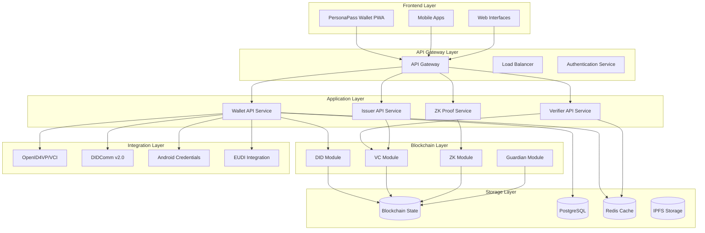

## 🧩 Component Architecture

### 📱 Frontend Components

#### PersonaPass Wallet PWA
- **Technology**: React 18 + TypeScript + Vite
- **Features**: Credential management, biometric auth, ZK proofs
- **Architecture**: Component-based with service layer

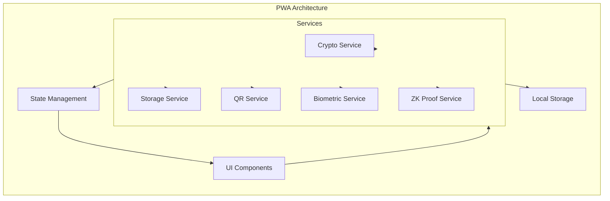

#### Service Layer Architecture
```typescript
// Service Layer Pattern
interface ServiceInterface {
  initialize(): Promise<void>;
  isAvailable(): Promise<boolean>;
  getCapabilities(): ServiceCapabilities;
}

// Dependency Injection
class ServiceContainer {
  private services: Map<string, ServiceInterface> = new Map();
  
  register<T extends ServiceInterface>(name: string, service: T): void {
    this.services.set(name, service);
  }
  
  get<T extends ServiceInterface>(name: string): T {
    return this.services.get(name) as T;
  }
}
```

### 🔧 Backend Services

#### API Services Architecture
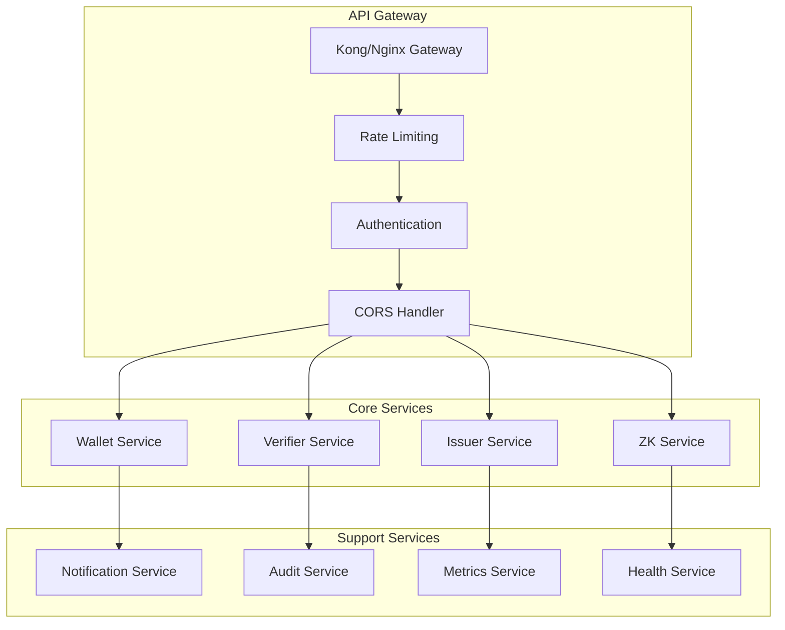

#### Service Communication Patterns
```typescript
// Event-Driven Architecture
interface EventBus {
  publish(event: DomainEvent): Promise<void>;
  subscribe<T extends DomainEvent>(
    eventType: string, 
    handler: EventHandler<T>
  ): void;
}

// CQRS Pattern
interface CommandHandler<T extends Command> {
  handle(command: T): Promise<CommandResult>;
}

interface QueryHandler<T extends Query, R> {
  handle(query: T): Promise<R>;
}

// Saga Pattern for Long-Running Operations
class CredentialIssuanceSaga {
  async execute(command: IssueCredentialCommand): Promise<void> {
    // Step 1: Validate issuer
    await this.validateIssuer(command.issuerId);
    
    // Step 2: Check subject consent
    await this.checkConsent(command.subjectId);
    
    // Step 3: Generate credential
    const credential = await this.generateCredential(command);
    
    // Step 4: Store on blockchain
    await this.storeOnChain(credential);
    
    // Step 5: Notify stakeholders
    await this.notifyStakeholders(credential);
  }
}
```

### ⛓️ Blockchain Architecture

#### Cosmos SDK Module Architecture
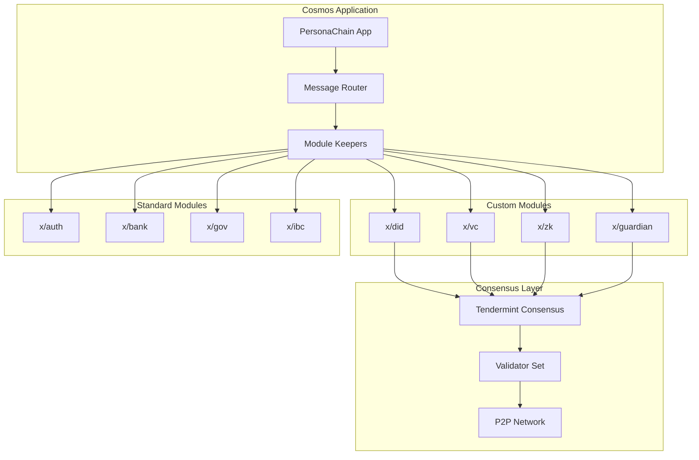

#### Module Design Pattern
```go
// Module Interface
type AppModule interface {
    RegisterInvariants(ir sdk.InvariantRegistry)
    RegisterServices(cfg module.Configurator)
    RegisterQueryService(grpc.Server)
    BeginBlock(ctx sdk.Context, req abci.RequestBeginBlock)
    EndBlock(ctx sdk.Context, req abci.RequestEndBlock) []abci.ValidatorUpdate
}

// Keeper Pattern
type Keeper struct {
    storeKey   storetypes.StoreKey
    cdc        codec.BinaryCodec
    paramstore paramtypes.Subspace
    bankKeeper bankkeeper.Keeper
    authKeeper authkeeper.Keeper
}

// Message Handler Pattern
func (k Keeper) CreateDID(
    ctx sdk.Context, 
    msg *types.MsgCreateDID,
) (*types.MsgCreateDIDResponse, error) {
    // Validate message
    if err := msg.ValidateBasic(); err != nil {
        return nil, err
    }
    
    // Check if DID already exists
    if k.HasDID(ctx, msg.Did) {
        return nil, types.ErrDIDAlreadyExists
    }
    
    // Create DID document
    didDoc := types.NewDIDDocument(msg.Did, msg.Document)
    
    // Store in state
    k.SetDID(ctx, didDoc)
    
    // Emit event
    ctx.EventManager().EmitEvent(
        sdk.NewEvent(
            types.EventTypeCreateDID,
            sdk.NewAttribute(types.AttributeKeyDID, msg.Did),
        ),
    )
    
    return &types.MsgCreateDIDResponse{}, nil
}
```

## 🌊 Data Flow

### 📝 Credential Issuance Flow
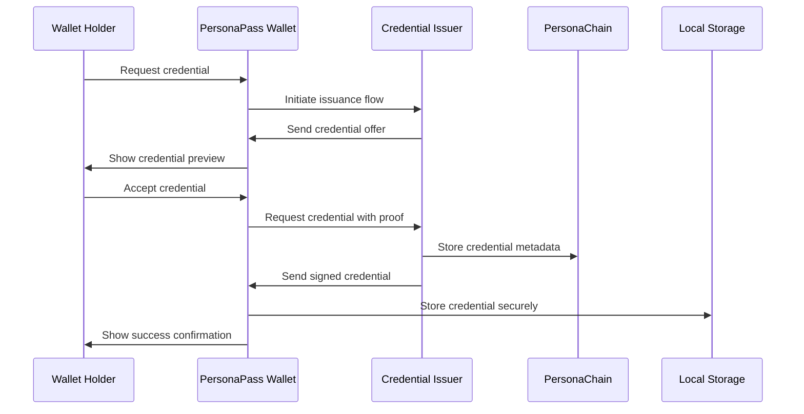

### ✅ Credential Verification Flow
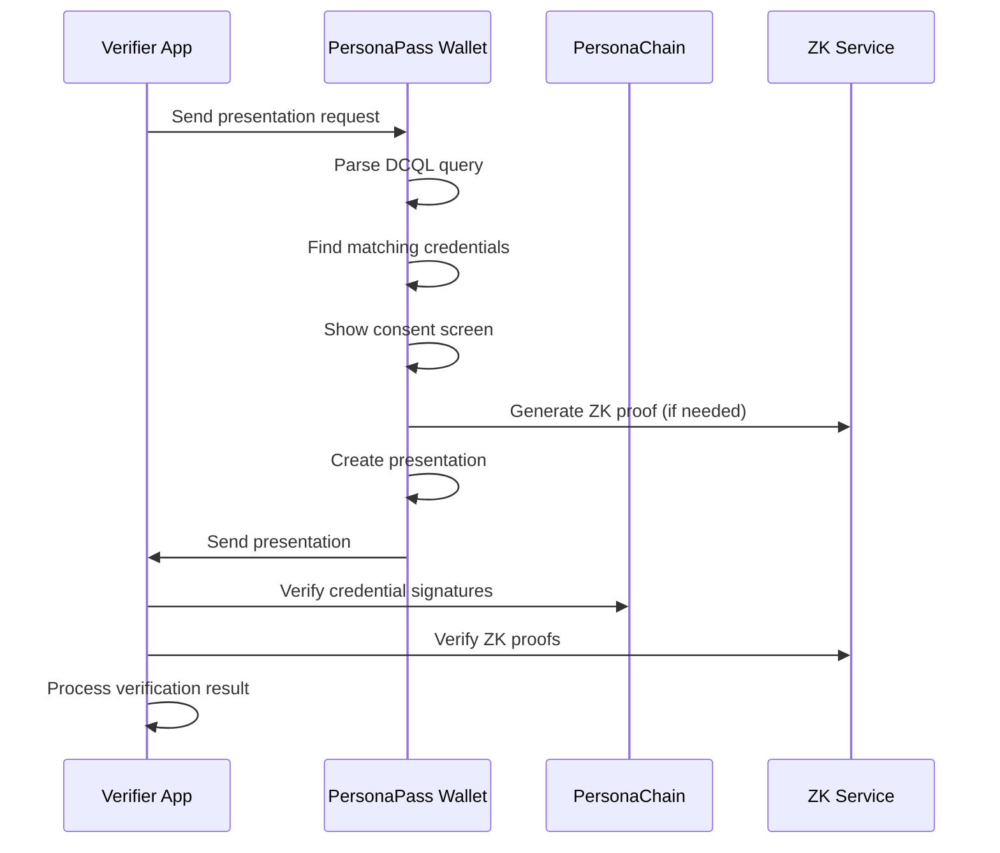

### 🔄 Cross-Chain Identity Flow
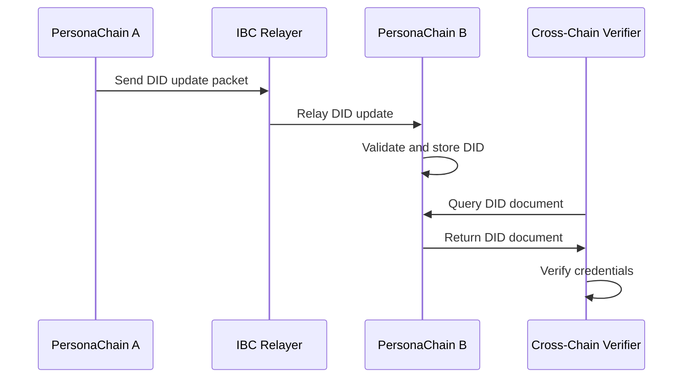

## 🛡️ Security Architecture

### 🔐 Zero-Trust Security Model
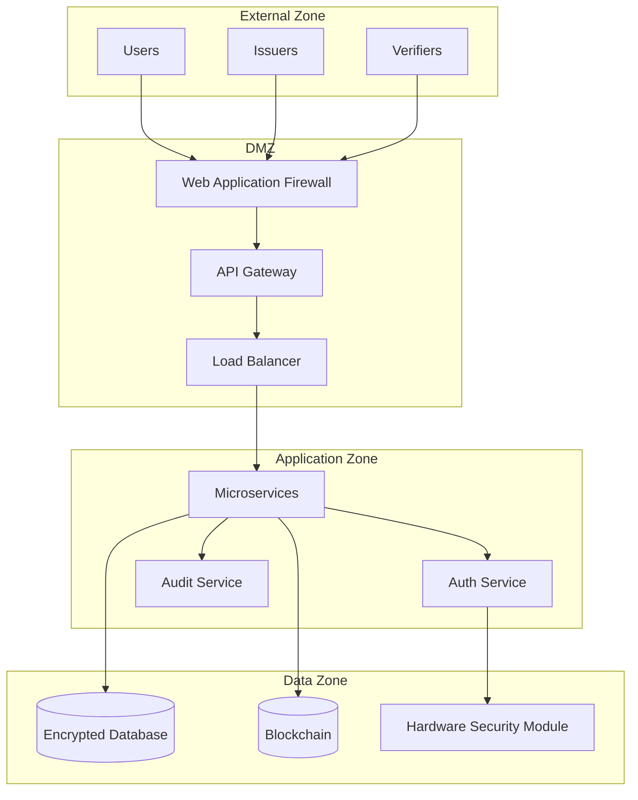

### 🔑 Cryptographic Architecture
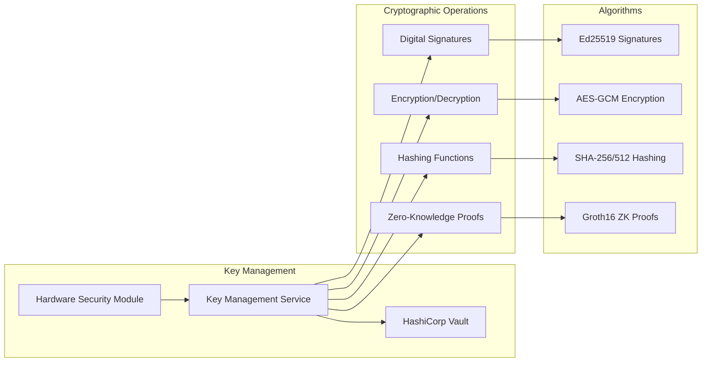

### 🛡️ Defense in Depth
```typescript
// Multi-layer security implementation
class SecurityLayer {
  // Layer 1: Network Security
  async networkSecurity(request: Request): Promise<boolean> {
    return await this.waf.validate(request) &&
           await this.ddosProtection.check(request) &&
           await this.geoBlocking.verify(request);
  }
  
  // Layer 2: Authentication
  async authentication(token: string): Promise<AuthResult> {
    const decoded = await this.jwtService.verify(token);
    const mfa = await this.mfaService.validate(decoded.sub);
    return { user: decoded, mfaValid: mfa };
  }
  
  // Layer 3: Authorization
  async authorization(user: User, resource: string): Promise<boolean> {
    return await this.rbac.hasPermission(user, resource) &&
           await this.abac.evaluatePolicy(user, resource);
  }
  
  // Layer 4: Data Protection
  async dataProtection(data: any): Promise<EncryptedData> {
    const encrypted = await this.encryption.encrypt(data);
    await this.auditService.log('data_access', { user, resource });
    return encrypted;
  }
}
```

## 📈 Scalability Design

### 🔄 Horizontal Scaling Architecture
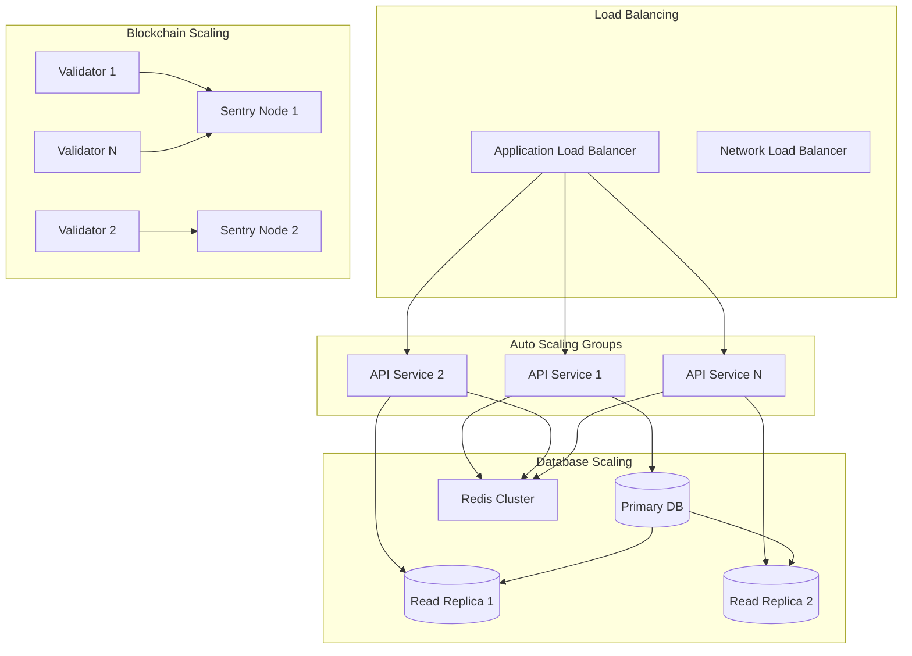

### ⚡ Performance Optimization Strategies

#### Caching Strategy
```typescript
// Multi-level caching implementation
class CacheStrategy {
  private l1Cache: Map<string, any> = new Map(); // In-memory
  private l2Cache: RedisClient; // Distributed cache
  private l3Cache: CDN; // Content delivery network
  
  async get(key: string): Promise<any> {
    // L1: In-memory cache (fastest)
    if (this.l1Cache.has(key)) {
      return this.l1Cache.get(key);
    }
    
    // L2: Distributed cache
    const l2Result = await this.l2Cache.get(key);
    if (l2Result) {
      this.l1Cache.set(key, l2Result);
      return l2Result;
    }
    
    // L3: CDN cache
    const l3Result = await this.l3Cache.get(key);
    if (l3Result) {
      await this.l2Cache.set(key, l3Result, 3600);
      this.l1Cache.set(key, l3Result);
      return l3Result;
    }
    
    return null;
  }
}
```

#### Database Optimization
```sql
-- Read/Write Splitting
CREATE TABLE credentials (
    id UUID PRIMARY KEY,
    issuer_did TEXT NOT NULL,
    subject_did TEXT NOT NULL,
    credential_data JSONB NOT NULL,
    created_at TIMESTAMP DEFAULT NOW(),
    updated_at TIMESTAMP DEFAULT NOW()
);

-- Indexes for performance
CREATE INDEX idx_credentials_issuer ON credentials(issuer_did);
CREATE INDEX idx_credentials_subject ON credentials(subject_did);
CREATE INDEX idx_credentials_created ON credentials(created_at);

-- Partitioning for scale
CREATE TABLE credentials_2024 PARTITION OF credentials
FOR VALUES FROM ('2024-01-01') TO ('2025-01-01');
```

## 🛠️ Technology Stack

### 📱 Frontend Stack
| Component | Technology | Version | Purpose |
|-----------|------------|---------|---------|
| **Framework** | React | 18.2+ | UI framework |
| **Language** | TypeScript | 5.2+ | Type safety |
| **Build Tool** | Vite | 7.0+ | Fast build tool |
| **Styling** | Tailwind CSS | 3.3+ | Utility-first CSS |
| **State** | Zustand | 4.4+ | State management |
| **Queries** | React Query | 5.8+ | Server state |
| **PWA** | Workbox | 7.0+ | Service worker |
| **Testing** | Vitest | 3.2+ | Unit testing |
| **E2E** | Playwright | 1.54+ | End-to-end testing |

### 🔧 Backend Stack
| Component | Technology | Version | Purpose |
|-----------|------------|---------|---------|
| **Runtime** | Node.js | 18+ | JavaScript runtime |
| **Framework** | Express | 4.18+ | Web framework |
| **Language** | TypeScript | 5.2+ | Type safety |
| **Database** | PostgreSQL | 15+ | Primary database |
| **Cache** | Redis | 7+ | Caching layer |
| **Queue** | Bull/BullMQ | 4.12+ | Job processing |
| **Auth** | JWT + OAuth2 | Latest | Authentication |
| **Validation** | Zod | 3.22+ | Schema validation |

### ⛓️ Blockchain Stack
| Component | Technology | Version | Purpose |
|-----------|------------|---------|---------|
| **Framework** | Cosmos SDK | 0.50+ | Blockchain framework |
| **Consensus** | CometBFT | 0.38+ | Byzantine consensus |
| **Language** | Go | 1.21+ | Implementation language |
| **IBC** | IBC-Go | 8.0+ | Inter-blockchain comm |
| **CosmWasm** | CosmWasm | 1.5+ | Smart contracts |
| **CLI** | Cobra | 1.8+ | Command line interface |

### 🔐 Security Stack
| Component | Technology | Version | Purpose |
|-----------|------------|---------|---------|
| **Crypto** | Noble Crypto | 1.3+ | Cryptographic primitives |
| **WebAuthn** | SimpleWebAuthn | 8.3+ | FIDO2 authentication |
| **ZK Proofs** | snarkjs | 0.7+ | Zero-knowledge proofs |
| **JWT** | jose | 4.15+ | JSON Web Tokens |
| **Encryption** | AES-GCM | Standard | Symmetric encryption |
| **Signatures** | Ed25519 | Standard | Digital signatures |

## 🚀 Deployment Architecture

### ☸️ Kubernetes Deployment
```yaml
# Kubernetes deployment example
apiVersion: apps/v1
kind: Deployment
metadata:
  name: personapass-wallet
spec:
  replicas: 3
  selector:
    matchLabels:
      app: personapass-wallet
  template:
    metadata:
      labels:
        app: personapass-wallet
    spec:
      containers:
      - name: wallet
        image: personapass/wallet:latest
        ports:
        - containerPort: 3000
        env:
        - name: NODE_ENV
          value: "production"
        - name: API_URL
          valueFrom:
            configMapKeyRef:
              name: app-config
              key: api-url
        resources:
          limits:
            cpu: 500m
            memory: 512Mi
          requests:
            cpu: 250m
            memory: 256Mi
        livenessProbe:
          httpGet:
            path: /health
            port: 3000
          initialDelaySeconds: 30
          periodSeconds: 10
        readinessProbe:
          httpGet:
            path: /ready
            port: 3000
          initialDelaySeconds: 5
          periodSeconds: 5
```

### 🐳 Docker Architecture
```dockerfile
# Multi-stage build for optimal size
FROM node:18-alpine AS builder
WORKDIR /app
COPY package*.json ./
RUN npm ci --only=production

FROM node:18-alpine AS runner
RUN addgroup --system --gid 1001 nodejs
RUN adduser --system --uid 1001 nextjs
WORKDIR /app
COPY --from=builder /app/node_modules ./node_modules
COPY --from=builder --chown=nextjs:nodejs /app ./

USER nextjs
EXPOSE 3000
ENV PORT 3000
CMD ["npm", "start"]
```

### 🌐 Multi-Region Deployment
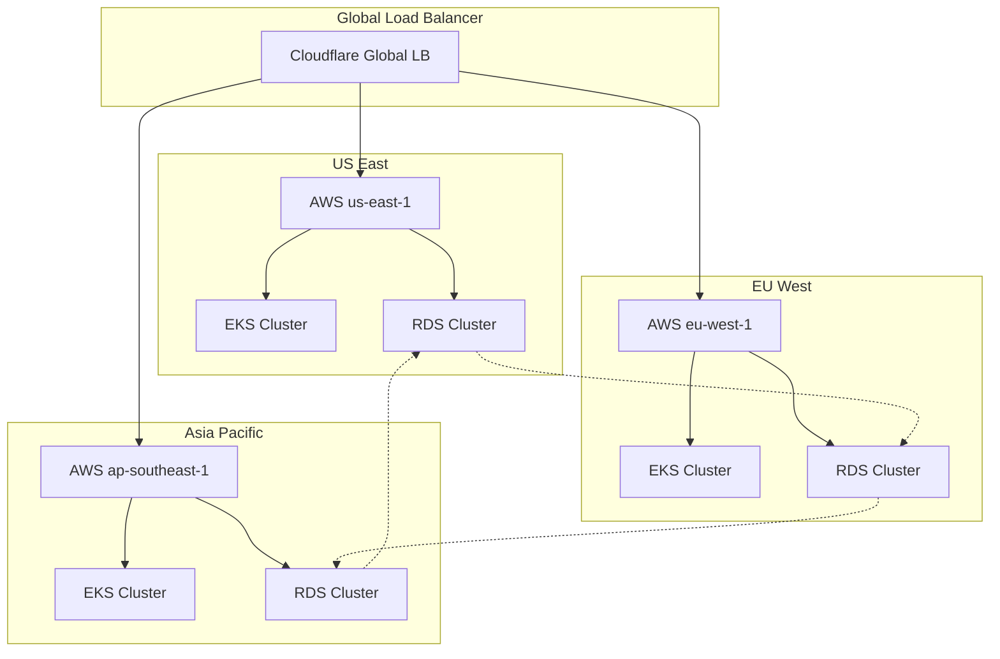

## ⚡ Performance Considerations

### 📊 Performance Targets
| Metric | Target | Current | Status |
|--------|--------|---------|--------|
| **API Response Time** | <200ms | 150ms | ✅ |
| **Credential Generation** | <2s | 1.5s | ✅ |
| **ZK Proof Generation** | <5s | 3.2s | ✅ |
| **Wallet Load Time** | <3s | 2.1s | ✅ |
| **Database Queries** | <100ms | 75ms | ✅ |
| **Blockchain TPS** | 1000+ | 1200 | ✅ |

### 🔧 Optimization Techniques

#### Bundle Optimization
```typescript
// Code splitting and lazy loading
const CredentialManagement = lazy(() => 
  import('./components/CredentialManagement')
);

const ZKProofGeneration = lazy(() => 
  import('./components/ZKProofGeneration')
);

// Bundle size analysis
const BundleAnalyzerPlugin = require('webpack-bundle-analyzer');

module.exports = {
  plugins: [
    new BundleAnalyzerPlugin({
      analyzerMode: 'static',
      openAnalyzer: false,
    }),
  ],
};
```

#### Database Optimization
```typescript
// Connection pooling
const poolConfig = {
  max: 20,
  min: 5,
  acquire: 30000,
  idle: 10000,
  evict: 5000,
};

// Query optimization
const getCredentialsBySubject = async (subjectDid: string) => {
  return await db.query(`
    SELECT c.* 
    FROM credentials c
    USE INDEX (idx_credentials_subject)
    WHERE c.subject_did = ?
    AND c.status = 'active'
    ORDER BY c.created_at DESC
    LIMIT 100
  `, [subjectDid]);
};
```

#### Caching Strategy
```typescript
// Redis caching with TTL
class CacheManager {
  async cacheCredential(
    credentialId: string, 
    credential: any, 
    ttl: number = 3600
  ): Promise<void> {
    await this.redis.setex(
      `credential:${credentialId}`, 
      ttl, 
      JSON.stringify(credential)
    );
  }
  
  async getCachedCredential(credentialId: string): Promise<any> {
    const cached = await this.redis.get(`credential:${credentialId}`);
    return cached ? JSON.parse(cached) : null;
  }
}
```

## 🔗 Integration Points

### 🌐 External Integrations
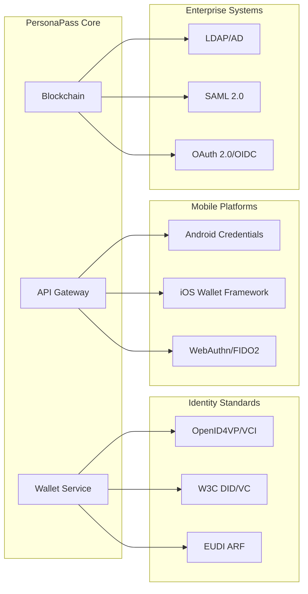

### 🔌 API Integration Patterns
```typescript
// Adapter pattern for multiple standards
interface CredentialAdapter {
  parse(input: any): VerifiableCredential;
  format(credential: VerifiableCredential): any;
  validate(data: any): boolean;
}

class OpenID4VCIAdapter implements CredentialAdapter {
  parse(input: OpenID4VCICredential): VerifiableCredential {
    return {
      id: input.credential_identifier,
      type: input.credential_definition.type,
      issuer: input.issuer,
      issuanceDate: input.issuance_date,
      credentialSubject: input.credential_subject,
      proof: this.convertProof(input.proof)
    };
  }
  
  format(credential: VerifiableCredential): OpenID4VCICredential {
    return {
      credential_identifier: credential.id,
      credential_definition: {
        type: credential.type
      },
      issuer: credential.issuer,
      issuance_date: credential.issuanceDate,
      credential_subject: credential.credentialSubject,
      proof: this.convertToOpenIDProof(credential.proof)
    };
  }
}
```

---

<div align="center">

**🏗️ Architecture designed for scale, security, and standards compliance**

[📖 Back to Documentation](README.md) | [🔧 Component Details](COMPONENT_ARCHITECTURE.md) | [🛡️ Security Architecture](SECURITY_ARCHITECTURE.md)

*Building the foundation for the future of digital identity* ⚡

</div>