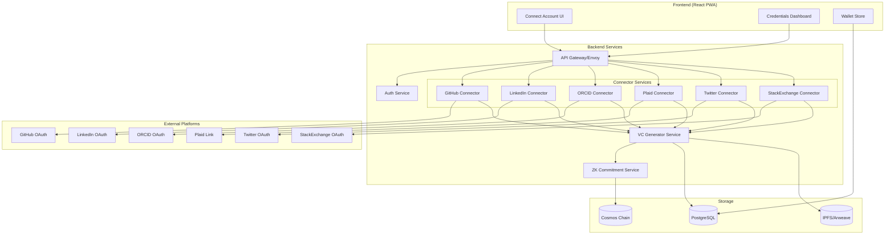
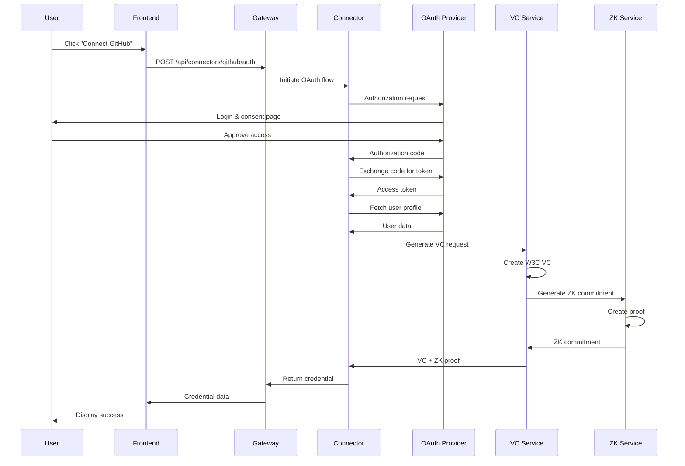
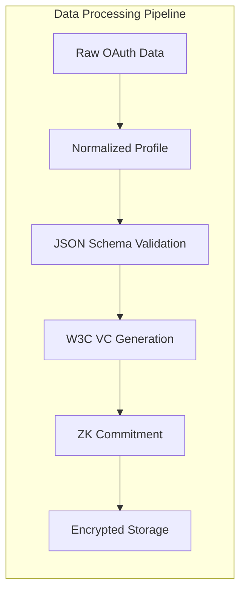
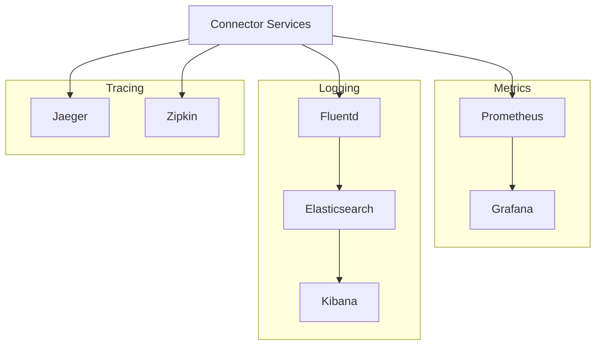

# PersonaPass Credential Connectors Architecture

## Overview

PersonaPass credential connectors enable users to import verified credentials from external platforms (GitHub, LinkedIn, ORCID, Plaid, Twitter, StackExchange) and convert them into W3C Verifiable Credentials with optional zero-knowledge proofs for selective disclosure.

## Architecture Diagram



## OAuth2 Flow Sequence



## Security Architecture

```mermaid
graph TB
    subgraph "Security Layers"
        TLS[TLS 1.3]
        MTLS[mTLS Between Services]
        JWT[JWT Authentication]
        PKCE[PKCE OAuth Flow]
        DPoP[DPoP Token Binding]
    end
    
    subgraph "Key Management"
        HSM[Hardware Security Module]
        KMS[Key Management Service]
        Vault[HashiCorp Vault]
    end
    
    subgraph "Access Control"
        RBAC[Role-Based Access]
        ABAC[Attribute-Based Access]
        Policy[OPA Policy Engine]
    end
    
    TLS --> MTLS
    MTLS --> JWT
    JWT --> PKCE
    PKCE --> DPoP
    
    HSM --> KMS
    KMS --> Vault
    
    RBAC --> ABAC
    ABAC --> Policy
```



## Data Flow Architecture



## Component Architecture

### 1. Frontend Components
- **ConnectorButton**: OAuth initiation UI
- **ConnectorStatus**: Connection state display
- **CredentialCard**: Imported credential display
- **CredentialActions**: Issue/present/revoke actions
- **ConsentDialog**: Data usage consent UI

### 2. Backend Services
- **OAuth Handler**: PKCE flow implementation
- **Profile Mapper**: Platform-specific data mapping
- **VC Generator**: W3C credential creation
- **ZK Service**: Privacy-preserving proofs
- **Storage Service**: Encrypted credential storage

### 3. Infrastructure
- **Kubernetes**: Container orchestration
- **Envoy Proxy**: Service mesh & TLS termination
- **Redis**: Session & token caching
- **PostgreSQL**: Credential metadata
- **IPFS**: Decentralized credential storage

## Deployment Architecture

```yaml
apiVersion: v1
kind: Service
metadata:
  name: connector-service
spec:
  type: ClusterIP
  ports:
  - port: 443
    targetPort: 8443
    protocol: TCP
  selector:
    app: connector
---
apiVersion: apps/v1
kind: Deployment
metadata:
  name: connector-deployment
spec:
  replicas: 3
  selector:
    matchLabels:
      app: connector
  template:
    metadata:
      labels:
        app: connector
    spec:
      containers:
      - name: connector
        image: personapass/connector:latest
        ports:
        - containerPort: 8443
        env:
        - name: OAUTH_CLIENT_ID
          valueFrom:
            secretKeyRef:
              name: oauth-secrets
              key: client-id
        - name: OAUTH_CLIENT_SECRET
          valueFrom:
            secretKeyRef:
              name: oauth-secrets
              key: client-secret
```

## Monitoring & Observability



## Performance Requirements

- OAuth flow completion: < 3 seconds
- VC generation: < 500ms
- ZK proof generation: < 2 seconds
- API response time: < 200ms (p99)
- Concurrent connections: 10,000+
- Availability: 99.9% uptime