# PersonaPass Operations Guide 🔧

> **Production operations manual** - Comprehensive guide for maintaining, monitoring, and operating PersonaPass Identity Platform in production environments.

## 📋 Table of Contents

- [Operations Overview](#operations-overview)
- [Daily Operations](#daily-operations)
- [Monitoring & Alerting](#monitoring--alerting)
- [Incident Response](#incident-response)
- [Maintenance Procedures](#maintenance-procedures)
- [Performance Management](#performance-management)
- [Security Operations](#security-operations)
- [Backup & Recovery](#backup--recovery)

## 🌐 Operations Overview

### 🎯 Operational Objectives

PersonaPass operations focus on maintaining **99.9% uptime**, **sub-200ms response times**, and **enterprise-grade security** while ensuring **seamless user experience** and **regulatory compliance**.

```mermaid
graph TB
    subgraph "Operations Dashboard"
        Availability[🔋 Availability<br/>99.9% SLA]
        Performance[⚡ Performance<br/>< 200ms API]
        Security[🛡️ Security<br/>Zero Incidents]
        Compliance[📋 Compliance<br/>SOC 2 Type II]
    end
    
    subgraph "Key Metrics"
        Users[👥 Active Users<br/>Real-time]
        Transactions[💳 Transactions<br/>Per Second]
        Storage[💾 Storage<br/>Usage]
        Network[🌐 Network<br/>Latency]
    end
    
    subgraph "Operations Team"
        OnCall[📱 On-Call Engineer]
        SRE[👨‍💻 Site Reliability]
        Security[🛡️ Security Team]
        Support[🆘 Customer Support]
    end
    
    Availability --> OnCall
    Performance --> SRE
    Security --> Security
    Compliance --> Support
```



### 📊 Service Level Objectives (SLOs)

| Service | Availability | Latency (P95) | Error Rate | Recovery Time |
|---------|-------------|---------------|------------|---------------|
| **🌐 Web Wallet** | 99.9% | < 1s | < 0.1% | < 5 minutes |
| **📡 API Gateway** | 99.95% | < 200ms | < 0.05% | < 2 minutes |
| **💾 Database** | 99.99% | < 50ms | < 0.01% | < 1 minute |
| **⛓️ Blockchain** | 99.9% | < 6s | < 0.1% | < 10 minutes |
| **🔐 Auth Service** | 99.95% | < 100ms | < 0.05% | < 2 minutes |

### 🏗️ Infrastructure Architecture


## 📅 Daily Operations

### 🌅 Daily Operational Checklist

#### Morning Health Check (09:00 UTC)
```bash
#!/bin/bash
# daily-health-check.sh

echo "🌅 PersonaPass Daily Health Check - $(date)"
echo "============================================"

# 1. System Status Overview
echo "📊 System Status:"
kubectl get pods -n personapass -o wide | grep -E "(Running|Pending|Failed)"

# 2. Resource Utilization
echo -e "\n💾 Resource Usage:"
kubectl top nodes
kubectl top pods -n personapass --sort-by=memory | head -10

# 3. Database Health
echo -e "\n🗄️ Database Status:"
kubectl exec -n personapass deployment/postgres -- psql -U personapass -d personapass -c "
    SELECT 
        'connections' as metric, 
        count(*) as value 
    FROM pg_stat_activity 
    UNION ALL
    SELECT 
        'database_size', 
        pg_size_pretty(pg_database_size('personapass'))::text
    UNION ALL
    SELECT 
        'cache_hit_ratio', 
        round(100 * sum(blks_hit) / (sum(blks_hit) + sum(blks_read)))::text || '%'
    FROM pg_stat_database 
    WHERE datname = 'personapass';
"

# 4. API Health Check
echo -e "\n🚀 API Health:"
curl -s https://api.personapass.id/health | jq '.'

# 5. Blockchain Status
echo -e "\n⛓️ Blockchain Status:"
curl -s http://localhost:26657/status | jq '.result.sync_info'

# 6. Certificate Expiry Check
echo -e "\n🔒 Certificate Status:"
echo | openssl s_client -servername api.personapass.id -connect api.personapass.id:443 2>/dev/null | \
    openssl x509 -noout -dates | grep notAfter

# 7. Backup Verification
echo -e "\n💾 Backup Status:"
kubectl get cronjobs -n personapass
aws s3 ls s3://personapass-backups/ --recursive | tail -5

echo -e "\n✅ Daily health check completed!"
```

#### Business Hours Monitoring (09:00-17:00 UTC)

**Every Hour:**
- Check dashboard alerts and metrics
- Review error logs for anomalies  
- Monitor user support tickets
- Verify backup job completion

**Key Dashboards to Monitor:**
- **📊 Grafana**: System metrics and performance
- **🔍 Kibana**: Application logs and errors
- **📈 Datadog**: User experience and business metrics
- **🛡️ Security Dashboard**: Security events and threats

### 🌙 Evening Operations (18:00 UTC)

#### Daily Maintenance Window
```bash
#!/bin/bash
# evening-maintenance.sh

echo "🌙 Evening Maintenance - $(date)"
echo "================================"

# 1. Database Maintenance
echo "🗄️ Running database maintenance..."
kubectl exec -n personapass deployment/postgres -- psql -U personapass -d personapass -c "
    -- Update table statistics
    ANALYZE;
    
    -- Clean up old audit logs (keep 90 days)
    DELETE FROM audit_logs WHERE created_at < NOW() - INTERVAL '90 days';
    
    -- Clean up expired sessions
    DELETE FROM user_sessions WHERE expires_at < NOW();
    
    -- Vacuum analyze for performance
    VACUUM ANALYZE;
"

# 2. Cache Cleanup
echo "🧹 Cleaning Redis cache..."
kubectl exec -n personapass deployment/redis -- redis-cli FLUSHDB

# 3. Log Rotation
echo "📝 Rotating application logs..."
kubectl exec -n personapass deployment/api -- logrotate /etc/logrotate.conf

# 4. Security Scan
echo "🛡️ Running security scan..."
trivy image personapass/api:latest --exit-code 1

# 5. Backup Verification
echo "💾 Verifying today's backups..."
backup_date=$(date +%Y-%m-%d)
aws s3 ls s3://personapass-backups/daily/${backup_date}/ || echo "❌ Backup missing!"

echo "✅ Evening maintenance completed!"
```

### 📈 Weekly Operations (Monday 02:00 UTC)

#### Weekly Health Report
```bash
#!/bin/bash
# weekly-health-report.sh

echo "📊 PersonaPass Weekly Health Report"
echo "Week of $(date -d 'monday -1 week' +%Y-%m-%d) to $(date -d 'sunday' +%Y-%m-%d)"
echo "=================================================="

# 1. SLA Performance
echo "📈 SLA Performance:"
curl -s "https://api.datadog.com/api/v1/query?query=avg:personapass.uptime{*}" \
    -H "DD-API-KEY: $DD_API_KEY" \
    -H "DD-APPLICATION-KEY: $DD_APP_KEY" | jq '.'

# 2. User Growth
echo -e "\n👥 User Metrics:"
kubectl exec -n personapass deployment/postgres -- psql -U personapass -d personapass -c "
    SELECT 
        'total_users' as metric,
        count(*) as value
    FROM users
    UNION ALL
    SELECT 
        'active_this_week',
        count(distinct user_id)
    FROM user_sessions 
    WHERE created_at >= NOW() - INTERVAL '7 days'
    UNION ALL
    SELECT 
        'new_this_week',
        count(*)
    FROM users 
    WHERE created_at >= NOW() - INTERVAL '7 days';
"

# 3. Performance Summary
echo -e "\n⚡ Performance Summary:"
curl -s "https://api.personapass.id/admin/metrics/weekly" | jq '.'

# 4. Security Events
echo -e "\n🛡️ Security Events:"
kubectl logs -n personapass deployment/api --since=7d | grep -i security | wc -l

# 5. Resource Trends
echo -e "\n💾 Resource Trends:"
kubectl describe nodes | grep -A 5 "Allocated resources"

echo -e "\n📧 Sending weekly report to operations team..."
# Email report to operations team
```

## 📊 Monitoring & Alerting

### 🎯 Monitoring Stack

```mermaid
graph TB
    subgraph "Data Collection"
        Prometheus[📊 Prometheus<br/>Metrics Collection]
        Fluentd[📝 Fluentd<br/>Log Aggregation]
        Jaeger[🔍 Jaeger<br/>Distributed Tracing]
        APM[📈 Application Performance<br/>Monitoring]
    end
    
    subgraph "Data Storage"
        PromDB[(Prometheus TSDB)]
        ElasticSearch[(Elasticsearch)]
        ClickHouse[(ClickHouse)]
    end
    
    subgraph "Visualization"
        Grafana[📊 Grafana<br/>Dashboards]
        Kibana[🔍 Kibana<br/>Log Analysis]
        Alerts[🚨 AlertManager<br/>Notifications]
    end
    
    subgraph "Alerting Channels"
        PagerDuty[📱 PagerDuty]
        Slack[💬 Slack]
        Email[📧 Email]
        SMS[📱 SMS]
    end
    
    Prometheus --> PromDB
    Fluentd --> ElasticSearch
    Jaeger --> ClickHouse
    APM --> PromDB
    
    PromDB --> Grafana
    ElasticSearch --> Kibana
    PromDB --> Alerts
    
    Alerts --> PagerDuty
    Alerts --> Slack
    Alerts --> Email
    Alerts --> SMS
```



### 📈 Key Dashboards

#### 1. System Overview Dashboard
```yaml
# grafana-dashboard-system.yml
dashboard:
  title: "PersonaPass System Overview"
  panels:
    - title: "Service Availability"
      type: "stat"
      targets:
        - expr: "up{job='personapass-api'}"
          legendFormat: "API"
        - expr: "up{job='personapass-web'}"
          legendFormat: "Web"
        - expr: "up{job='postgres'}"
          legendFormat: "Database"
    
    - title: "Request Rate"
      type: "graph"
      targets:
        - expr: "rate(http_requests_total[5m])"
          legendFormat: "{{method}} {{endpoint}}"
    
    - title: "Response Time (P95)"
      type: "graph"
      targets:
        - expr: "histogram_quantile(0.95, rate(http_request_duration_seconds_bucket[5m]))"
          legendFormat: "P95 Response Time"
    
    - title: "Error Rate"
      type: "graph"
      targets:
        - expr: "rate(http_requests_total{status=~'5..'}[5m]) / rate(http_requests_total[5m])"
          legendFormat: "5xx Error Rate"
```

#### 2. Application Performance Dashboard
```yaml
# grafana-dashboard-application.yml
dashboard:
  title: "PersonaPass Application Performance"
  panels:
    - title: "Active Users"
      type: "stat"
      targets:
        - expr: "personapass_active_users"
          legendFormat: "Active Users"
    
    - title: "Credential Operations"
      type: "graph"
      targets:
        - expr: "rate(personapass_credential_operations_total[5m])"
          legendFormat: "{{operation}}"
    
    - title: "ZK Proof Generation Time"
      type: "histogram"
      targets:
        - expr: "personapass_zk_proof_generation_seconds"
          legendFormat: "{{circuit_type}}"
    
    - title: "Database Query Performance"
      type: "graph"
      targets:
        - expr: "rate(postgres_queries_total[5m])"
          legendFormat: "{{query_type}}"
```

#### 3. Security Dashboard
```yaml
# grafana-dashboard-security.yml
dashboard:
  title: "PersonaPass Security Monitoring"
  panels:
    - title: "Authentication Failures"
      type: "graph"
      targets:
        - expr: "rate(personapass_auth_failures_total[5m])"
          legendFormat: "{{reason}}"
    
    - title: "Rate Limit Hits"
      type: "stat"
      targets:
        - expr: "rate(personapass_rate_limit_exceeded_total[5m])"
          legendFormat: "Rate Limits"
    
    - title: "Certificate Expiry"
      type: "table"
      targets:
        - expr: "(cert_expiry_timestamp - time()) / 86400"
          legendFormat: "{{certificate}} (days)"
    
    - title: "Security Events"
      type: "graph"
      targets:
        - expr: "rate(personapass_security_events_total[5m])"
          legendFormat: "{{event_type}}"
```

### 🚨 Alert Rules

#### Critical Alerts (Page Immediately)
```yaml
# alerts-critical.yml
groups:
- name: personapass-critical
  rules:
  - alert: ServiceDown
    expr: up{job=~"personapass-.*"} == 0
    for: 1m
    labels:
      severity: critical
      team: sre
    annotations:
      summary: "Service {{ $labels.job }} is down"
      description: "Service {{ $labels.job }} has been down for more than 1 minute"
      runbook_url: "https://docs.personapass.id/runbooks/service-down"
  
  - alert: HighErrorRate
    expr: rate(http_requests_total{status=~"5.."}[5m]) > 0.1
    for: 2m
    labels:
      severity: critical
      team: sre
    annotations:
      summary: "High error rate detected"
      description: "Error rate is {{ $value }} per second"
      runbook_url: "https://docs.personapass.id/runbooks/high-error-rate"
  
  - alert: DatabaseConnectionFailure
    expr: postgres_up == 0
    for: 30s
    labels:
      severity: critical
      team: dba
    annotations:
      summary: "Database connection failure"
      description: "PostgreSQL database is unreachable"
      runbook_url: "https://docs.personapass.id/runbooks/database-down"
```

#### Warning Alerts (Slack Notifications)
```yaml
# alerts-warning.yml
groups:
- name: personapass-warning
  rules:
  - alert: HighResponseTime
    expr: histogram_quantile(0.95, rate(http_request_duration_seconds_bucket[5m])) > 1
    for: 5m
    labels:
      severity: warning
      team: sre
    annotations:
      summary: "High response time detected"
      description: "95th percentile response time is {{ $value }} seconds"
  
  - alert: HighMemoryUsage
    expr: container_memory_usage_bytes / container_spec_memory_limit_bytes > 0.8
    for: 10m
    labels:
      severity: warning
      team: sre
    annotations:
      summary: "High memory usage"
      description: "Memory usage is {{ $value | humanizePercentage }}"
  
  - alert: CertificateExpiringSoon
    expr: (cert_expiry_timestamp - time()) / 86400 < 30
    for: 1h
    labels:
      severity: warning
      team: security
    annotations:
      summary: "Certificate expiring soon"
      description: "Certificate {{ $labels.certificate }} expires in {{ $value }} days"
```

### 📱 On-Call Setup

#### PagerDuty Integration
```yaml
# pagerduty-integration.yml
routing_key: "YOUR_PAGERDUTY_INTEGRATION_KEY"
severity_mapping:
  critical: "critical"
  warning: "warning"
  info: "info"

escalation_policy:
  - level: 1
    delay: 0
    targets:
      - type: user
        id: "primary-oncall"
  - level: 2
    delay: 15  # minutes
    targets:
      - type: user
        id: "secondary-oncall"
  - level: 3
    delay: 30  # minutes
    targets:
      - type: schedule
        id: "manager-schedule"
```

#### On-Call Playbook
```markdown
# On-Call Response Playbook

## 🚨 Critical Alert Response (< 5 minutes)
1. **Acknowledge** the alert in PagerDuty
2. **Check** system dashboard for additional context
3. **Identify** the root cause using logs and metrics
4. **Implement** immediate fix or mitigation
5. **Update** incident status and communicate to team
6. **Document** incident and resolution steps

## 📞 Escalation Procedures
- **Level 1** (0-15 min): Primary on-call engineer
- **Level 2** (15-30 min): Secondary on-call engineer  
- **Level 3** (30+ min): Engineering manager
- **Level 4** (45+ min): CTO and executive team

## 🛠️ Common Issue Resolution
- **Service Down**: Check deployment status, restart if needed
- **High Error Rate**: Check recent deployments, rollback if necessary
- **Database Issues**: Check connections, failover if needed
- **Performance**: Check resource usage, scale if necessary
```

## 🚨 Incident Response

### 🎯 Incident Classification

| Severity | Impact | Response Time | Examples |
|----------|--------|---------------|----------|
| **🔴 P0 - Critical** | Service unavailable | < 15 minutes | Complete service outage, data loss |
| **🟠 P1 - High** | Major functionality impacted | < 1 hour | Authentication failures, slow performance |
| **🟡 P2 - Medium** | Minor functionality impacted | < 4 hours | Non-critical feature issues |
| **🟢 P3 - Low** | Cosmetic or minor issues | < 24 hours | UI bugs, documentation errors |

### 🔄 Incident Response Process


#### 1. Incident Detection
```bash
# Automated detection sources
- Monitoring alerts (Prometheus/Grafana)
- Health check failures
- User reports (support tickets)
- External monitoring (Pingdom, StatusPage)
- Security alerts (SIEM)
```

#### 2. Initial Response (< 5 minutes)
```markdown
## Immediate Actions:
1. **Acknowledge** alert and create incident ticket
2. **Assess** severity and impact
3. **Notify** appropriate stakeholders
4. **Begin** investigation
5. **Implement** immediate mitigations if available

## Communication Template:
**INCIDENT ALERT**
- **Severity**: P0/P1/P2/P3
- **Impact**: Description of user impact
- **Status**: Investigating/Mitigating/Resolved
- **ETA**: Estimated resolution time
- **Updates**: Every 30 minutes for P0/P1
```

#### 3. Investigation Playbook
```bash
#!/bin/bash
# incident-investigation.sh

echo "🔍 PersonaPass Incident Investigation"
echo "====================================="

# 1. Check service status
echo "📊 Service Status:"
kubectl get pods -n personapass -o wide

# 2. Check recent deployments
echo -e "\n🚀 Recent Deployments:"
kubectl rollout history deployment -n personapass

# 3. Check resource usage
echo -e "\n💾 Resource Usage:"
kubectl top pods -n personapass --sort-by=memory

# 4. Check logs for errors
echo -e "\n📝 Recent Errors:"
kubectl logs -n personapass deployment/api --since=30m | grep -i error | tail -10

# 5. Check external dependencies
echo -e "\n🌐 External Dependencies:"
curl -s https://api.keyless.io/health
curl -s https://status.aws.amazon.com/

# 6. Check database status
echo -e "\n🗄️ Database Status:"
kubectl exec -n personapass deployment/postgres -- pg_isready

# 7. Check metrics
echo -e "\n📈 Key Metrics:"
curl -s "http://prometheus:9090/api/v1/query?query=up{job='personapass-api'}"

echo -e "\n✅ Investigation data collected!"
```

#### 4. Communication Plan
```yaml
# Incident communication matrix
stakeholders:
  internal:
    engineering_team:
      channels: ["slack:engineering", "email"]
      frequency: "real-time"
    executive_team:
      channels: ["email", "phone"]
      frequency: "every 30 minutes for P0/P1"
    customer_support:
      channels: ["slack:support", "support-portal"]
      frequency: "every 15 minutes"
  
  external:
    customers:
      channels: ["status-page", "email"]
      frequency: "every hour for P0/P1"
    partners:
      channels: ["email", "partner-portal"]
      frequency: "as needed"
    regulators:
      channels: ["secure-email"]
      frequency: "for security incidents only"
```

### 📋 Post-Incident Review

#### Post-Mortem Template
```markdown
# Incident Post-Mortem: [INCIDENT-ID]

## 📊 Incident Summary
- **Date**: YYYY-MM-DD
- **Duration**: X hours Y minutes
- **Severity**: P0/P1/P2/P3
- **Impact**: Description of user impact
- **Root Cause**: Primary cause of the incident

## ⏰ Timeline
| Time (UTC) | Event | Action Taken |
|------------|-------|--------------|
| HH:MM | Incident detected | Alert fired |
| HH:MM | Investigation began | Team notified |
| HH:MM | Root cause identified | Mitigation started |
| HH:MM | Resolution implemented | Service restored |

## 🔍 Root Cause Analysis
### What Happened?
Detailed explanation of what went wrong.

### Why Did It Happen?
Analysis of underlying causes and contributing factors.

### How Was It Detected?
How the incident was discovered and reported.

## 🛠️ Resolution
### Immediate Actions
Steps taken to restore service.

### Permanent Fix
Long-term resolution to prevent recurrence.

## 📊 Impact Assessment
- **Users Affected**: X users (Y% of total)
- **Revenue Impact**: $X estimated loss
- **SLA Impact**: X% availability for the month
- **Reputation Impact**: Customer feedback and media coverage

## 🎯 Action Items
| Action | Owner | Due Date | Status |
|--------|-------|----------|--------|
| Fix root cause | Engineering | 2024-01-20 | In Progress |
| Update monitoring | SRE | 2024-01-25 | Pending |
| Improve documentation | DevOps | 2024-01-30 | Pending |

## 📚 Lessons Learned
### What Went Well?
- Fast detection and response
- Good communication with stakeholders
- Effective team coordination

### What Could Be Improved?
- Earlier detection of the issue
- Better rollback procedures
- More comprehensive testing

## 📝 Follow-Up
- Schedule follow-up review in 2 weeks
- Update runbooks and procedures
- Share learnings with broader team
```

## 🔧 Maintenance Procedures

### 📅 Scheduled Maintenance

#### Monthly Maintenance Window (First Sunday, 02:00-06:00 UTC)
```bash
#!/bin/bash
# monthly-maintenance.sh

echo "🔧 PersonaPass Monthly Maintenance - $(date)"
echo "============================================="

# 1. System Updates
echo "🔄 Updating system packages..."
kubectl set image deployment/api api=personapass/api:latest -n personapass
kubectl set image deployment/web web=personapass/web:latest -n personapass

# 2. Database Maintenance
echo "🗄️ Database maintenance..."
kubectl exec -n personapass deployment/postgres -- psql -U personapass -d personapass -c "
    -- Full vacuum analyze
    VACUUM FULL ANALYZE;
    
    -- Reindex all tables
    REINDEX DATABASE personapass;
    
    -- Update statistics
    ANALYZE;
    
    -- Clean up old data
    DELETE FROM audit_logs WHERE created_at < NOW() - INTERVAL '1 year';
    DELETE FROM user_sessions WHERE expires_at < NOW() - INTERVAL '30 days';
"

# 3. Certificate Renewal
echo "🔒 Checking certificate renewal..."
kubectl annotate certificate personapass-tls -n personapass \
    cert-manager.io/force-renewal="$(date +%s)"

# 4. Backup Verification
echo "💾 Verifying backup integrity..."
latest_backup=$(aws s3 ls s3://personapass-backups/monthly/ | sort | tail -1 | awk '{print $4}')
aws s3 cp s3://personapass-backups/monthly/$latest_backup /tmp/test-backup.sql
if [ $? -eq 0 ]; then
    echo "✅ Backup verification successful"
else
    echo "❌ Backup verification failed"
fi

# 5. Security Scanning
echo "🛡️ Security scanning..."
trivy image personapass/api:latest
trivy image personapass/web:latest

# 6. Performance Testing
echo "⚡ Performance testing..."
kubectl apply -f k8s/performance-test-job.yaml

# 7. Cleanup
echo "🧹 Cleanup tasks..."
kubectl delete pods -n personapass --field-selector=status.phase=Succeeded
docker system prune -f

echo "✅ Monthly maintenance completed!"
```

#### Database Maintenance Procedures
```sql
-- Database maintenance script
-- Run during maintenance window

BEGIN;

-- 1. Update table statistics
ANALYZE;

-- 2. Vacuum full for heavily updated tables
VACUUM FULL users;
VACUUM FULL credentials;
VACUUM FULL presentations;

-- 3. Reindex critical indexes
REINDEX INDEX CONCURRENTLY idx_users_email;
REINDEX INDEX CONCURRENTLY idx_credentials_subject_did;
REINDEX INDEX CONCURRENTLY idx_presentations_verifier_id;

-- 4. Clean up old data
DELETE FROM audit_logs WHERE created_at < NOW() - INTERVAL '1 year';
DELETE FROM user_sessions WHERE expires_at < NOW() - INTERVAL '30 days';
DELETE FROM verification_requests WHERE created_at < NOW() - INTERVAL '90 days' AND status = 'expired';

-- 5. Update table statistics after cleanup
ANALYZE;

COMMIT;
```

### 🔄 Rolling Updates

#### Zero-Downtime Deployment Process
```bash
#!/bin/bash
# rolling-update.sh

APP_NAME=$1
IMAGE_TAG=$2
NAMESPACE="personapass"

echo "🚀 Rolling update for $APP_NAME to $IMAGE_TAG"

# 1. Pre-deployment checks
echo "🔍 Pre-deployment checks..."
kubectl get deployment $APP_NAME -n $NAMESPACE
kubectl get pods -n $NAMESPACE -l app=$APP_NAME

# 2. Update deployment
echo "📦 Updating deployment..."
kubectl set image deployment/$APP_NAME $APP_NAME=personapass/$APP_NAME:$IMAGE_TAG -n $NAMESPACE

# 3. Wait for rollout
echo "⏳ Waiting for rollout to complete..."
kubectl rollout status deployment/$APP_NAME -n $NAMESPACE --timeout=600s

# 4. Health check
echo "🏥 Health check..."
sleep 30
health_check=$(kubectl get pods -n $NAMESPACE -l app=$APP_NAME -o jsonpath='{.items[*].status.containerStatuses[*].ready}')

if [[ "$health_check" == *"false"* ]]; then
    echo "❌ Health check failed, rolling back..."
    kubectl rollout undo deployment/$APP_NAME -n $NAMESPACE
    exit 1
fi

# 5. Post-deployment verification
echo "✅ Deployment successful, running verification..."
curl -f https://api.personapass.id/health || {
    echo "❌ API health check failed, rolling back..."
    kubectl rollout undo deployment/$APP_NAME -n $NAMESPACE
    exit 1
}

echo "🎉 Rolling update completed successfully!"
```

#### Rollback Procedures
```bash
#!/bin/bash
# rollback.sh

APP_NAME=$1
NAMESPACE="personapass"

echo "🔄 Rolling back $APP_NAME"

# 1. Get rollout history
echo "📜 Rollout history:"
kubectl rollout history deployment/$APP_NAME -n $NAMESPACE

# 2. Rollback to previous version
echo "⏪ Rolling back to previous version..."
kubectl rollout undo deployment/$APP_NAME -n $NAMESPACE

# 3. Wait for rollback
echo "⏳ Waiting for rollback to complete..."
kubectl rollout status deployment/$APP_NAME -n $NAMESPACE --timeout=300s

# 4. Verify rollback
echo "✅ Verifying rollback..."
kubectl get pods -n $NAMESPACE -l app=$APP_NAME
curl -f https://api.personapass.id/health

echo "🎉 Rollback completed!"
```

## ⚡ Performance Management

### 📊 Performance Monitoring

#### Key Performance Indicators (KPIs)
```yaml
# Performance metrics configuration
performance_metrics:
  web_vitals:
    - metric: "first_contentful_paint"
      target: "< 1.5s"
      alert_threshold: "> 3s"
    - metric: "largest_contentful_paint"
      target: "< 2.5s"
      alert_threshold: "> 4s"
    - metric: "cumulative_layout_shift"
      target: "< 0.1"
      alert_threshold: "> 0.25"
  
  api_performance:
    - metric: "response_time_p95"
      target: "< 200ms"
      alert_threshold: "> 500ms"
    - metric: "throughput"
      target: "> 1000 rps"
      alert_threshold: "< 500 rps"
    - metric: "error_rate"
      target: "< 0.1%"
      alert_threshold: "> 1%"
  
  database_performance:
    - metric: "query_time_p95"
      target: "< 50ms"
      alert_threshold: "> 200ms"
    - metric: "connection_utilization"
      target: "< 70%"
      alert_threshold: "> 90%"
    - metric: "cache_hit_ratio"
      target: "> 95%"
      alert_threshold: "< 80%"
```

#### Performance Testing
```bash
#!/bin/bash
# performance-test.sh

echo "⚡ PersonaPass Performance Testing"
echo "================================="

# 1. Load Testing with Artillery
echo "🎯 Running load tests..."
artillery run tests/performance/load-test.yml

# 2. Stress Testing
echo "💪 Running stress tests..."
artillery run tests/performance/stress-test.yml

# 3. Database Performance
echo "🗄️ Database performance test..."
kubectl exec -n personapass deployment/postgres -- pgbench -c 10 -j 2 -t 1000 personapass

# 4. Web Performance Testing
echo "🌐 Web performance test..."
lighthouse --chrome-flags="--headless" https://wallet.personapass.id --output json --output-path /tmp/lighthouse.json

# 5. API Endpoint Testing
echo "🚀 API endpoint testing..."
curl -w "@curl-format.txt" -o /dev/null -s https://api.personapass.id/health

echo "✅ Performance testing completed!"
```

### 🎯 Capacity Planning

#### Resource Usage Analysis
```bash
#!/bin/bash
# capacity-analysis.sh

echo "📊 PersonaPass Capacity Analysis"
echo "================================"

# 1. Current resource usage
echo "💾 Current Resource Usage:"
kubectl top nodes
kubectl top pods -n personapass --sort-by=memory

# 2. Growth projections
echo -e "\n📈 Growth Projections:"
kubectl exec -n personapass deployment/postgres -- psql -U personapass -d personapass -c "
    SELECT 
        date_trunc('month', created_at) as month,
        count(*) as new_users,
        sum(count(*)) OVER (ORDER BY date_trunc('month', created_at)) as total_users
    FROM users 
    WHERE created_at >= NOW() - INTERVAL '12 months'
    GROUP BY date_trunc('month', created_at)
    ORDER BY month;
"

# 3. Resource recommendations
echo -e "\n🎯 Resource Recommendations:"
current_cpu=$(kubectl top nodes | awk 'NR>1 {sum+=$3} END {print sum}')
current_memory=$(kubectl top nodes | awk 'NR>1 {sum+=$5} END {print sum}')

echo "Current CPU usage: ${current_cpu}m"
echo "Current Memory usage: ${current_memory}Mi"
echo "Recommended scaling: Add 2 nodes if usage > 70%"

echo "✅ Capacity analysis completed!"
```

#### Scaling Procedures
```yaml
# Horizontal Pod Autoscaler configuration
apiVersion: autoscaling/v2
kind: HorizontalPodAutoscaler
metadata:
  name: personapass-api-hpa
  namespace: personapass
spec:
  scaleTargetRef:
    apiVersion: apps/v1
    kind: Deployment
    name: personapass-api
  minReplicas: 3
  maxReplicas: 20
  metrics:
  - type: Resource
    resource:
      name: cpu
      target:
        type: Utilization
        averageUtilization: 70
  - type: Resource
    resource:
      name: memory
      target:
        type: Utilization
        averageUtilization: 80
  behavior:
    scaleUp:
      stabilizationWindowSeconds: 60
      policies:
      - type: Percent
        value: 100
        periodSeconds: 15
    scaleDown:
      stabilizationWindowSeconds: 300
      policies:
      - type: Percent
        value: 10
        periodSeconds: 60
```

## 🛡️ Security Operations

### 🔍 Security Monitoring

#### Security Event Detection
```bash
#!/bin/bash
# security-monitoring.sh

echo "🛡️ PersonaPass Security Monitoring"
echo "==================================="

# 1. Failed authentication attempts
echo "🔐 Failed Authentication Attempts:"
kubectl logs -n personapass deployment/api --since=1h | \
    grep "authentication failed" | \
    awk '{print $1, $2, $5}' | \
    sort | uniq -c | sort -nr

# 2. Rate limiting events
echo -e "\n🚦 Rate Limiting Events:"
kubectl logs -n personapass deployment/api --since=1h | \
    grep "rate limit exceeded" | wc -l

# 3. Suspicious IP addresses
echo -e "\n🕵️ Suspicious IP Addresses:"
kubectl logs -n personapass deployment/api --since=1h | \
    grep -E "(403|429)" | \
    awk '{print $3}' | \
    sort | uniq -c | sort -nr | head -10

# 4. SSL/TLS certificate status
echo -e "\n🔒 Certificate Status:"
echo | openssl s_client -servername api.personapass.id -connect api.personapass.id:443 2>/dev/null | \
    openssl x509 -noout -dates

# 5. Vulnerability scan
echo -e "\n🔍 Vulnerability Scan:"
trivy image personapass/api:latest --severity HIGH,CRITICAL

echo "✅ Security monitoring completed!"
```

#### Security Incident Response
```yaml
# Security incident playbook
security_incidents:
  data_breach:
    severity: "P0"
    response_time: "< 15 minutes"
    actions:
      - "Isolate affected systems"
      - "Preserve forensic evidence"
      - "Notify security team and legal"
      - "Begin incident investigation"
      - "Prepare customer communication"
    
  unauthorized_access:
    severity: "P1"
    response_time: "< 30 minutes"
    actions:
      - "Revoke compromised credentials"
      - "Review access logs"
      - "Check for data exfiltration"
      - "Update access controls"
      - "Monitor for additional attempts"
  
  ddos_attack:
    severity: "P1"
    response_time: "< 15 minutes"
    actions:
      - "Enable DDoS protection"
      - "Scale infrastructure"
      - "Block malicious IPs"
      - "Notify ISP/CDN provider"
      - "Monitor service availability"
```

### 🔐 Access Management

#### Regular Access Reviews
```bash
#!/bin/bash
# access-review.sh

echo "🔐 PersonaPass Access Review"
echo "============================"

# 1. Kubernetes RBAC review
echo "👥 Kubernetes Access:"
kubectl get rolebindings,clusterrolebindings -o wide | \
    grep personapass

# 2. Database user review
echo -e "\n🗄️ Database Access:"
kubectl exec -n personapass deployment/postgres -- psql -U personapass -d personapass -c "
    SELECT 
        usename as username,
        usesuper as superuser,
        usecreatedb as createdb,
        valuntil as expires
    FROM pg_user
    ORDER BY usename;
"

# 3. API key review
echo -e "\n🔑 API Key Usage:"
kubectl exec -n personapass deployment/postgres -- psql -U personapass -d personapass -c "
    SELECT 
        api_key_id,
        user_id,
        last_used,
        created_at,
        expires_at
    FROM api_keys 
    WHERE expires_at > NOW()
    ORDER BY last_used DESC;
"

# 4. Admin user review
echo -e "\n👑 Admin Users:"
kubectl exec -n personapass deployment/postgres -- psql -U personapass -d personapass -c "
    SELECT 
        email,
        role,
        last_login,
        created_at
    FROM users 
    WHERE role IN ('admin', 'super_admin')
    ORDER BY last_login DESC;
"

echo "✅ Access review completed!"
```

#### Password and Key Rotation
```bash
#!/bin/bash
# key-rotation.sh

echo "🔄 PersonaPass Key Rotation"
echo "==========================="

# 1. Generate new JWT secret
echo "🔑 Rotating JWT secret..."
new_jwt_secret=$(openssl rand -base64 32)
kubectl patch secret -n personapass personapass-secrets \
    -p "{\"data\":{\"JWT_SECRET\":\"$(echo -n $new_jwt_secret | base64)\"}}"

# 2. Rotate database password
echo "🗄️ Rotating database password..."
new_db_password=$(openssl rand -base64 24)
kubectl patch secret -n personapass postgres-secrets \
    -p "{\"data\":{\"POSTGRES_PASSWORD\":\"$(echo -n $new_db_password | base64)\"}}"

# 3. Rotate API keys
echo "🔗 Rotating API keys..."
kubectl exec -n personapass deployment/postgres -- psql -U personapass -d personapass -c "
    UPDATE api_keys 
    SET expires_at = NOW() + INTERVAL '90 days'
    WHERE expires_at < NOW() + INTERVAL '30 days';
"

# 4. Update HSM keys
echo "🔐 Rotating HSM keys..."
# Implementation depends on HSM provider

# 5. Restart services to pick up new secrets
echo "🔄 Restarting services..."
kubectl rollout restart deployment/personapass-api -n personapass

echo "✅ Key rotation completed!"
```

## 💾 Backup & Recovery

### 🔄 Backup Strategy

#### Backup Types and Schedule
```yaml
# Backup configuration
backup_strategy:
  database:
    type: "PostgreSQL dump"
    frequency:
      - full: "daily at 02:00 UTC"
      - incremental: "every 6 hours"
    retention:
      - daily: "30 days"
      - weekly: "12 weeks"
      - monthly: "12 months"
      - yearly: "7 years"
    encryption: "AES-256"
    compression: "gzip"
  
  files:
    type: "Filesystem snapshot"
    frequency: "daily at 03:00 UTC"
    retention: "30 days"
    encryption: "AES-256"
  
  blockchain:
    type: "State snapshot"
    frequency: "daily at 04:00 UTC"
    retention: "forever"
    verification: "checksum"
```

#### Automated Backup Script
```bash
#!/bin/bash
# backup.sh

BACKUP_DATE=$(date +%Y-%m-%d_%H-%M-%S)
S3_BUCKET="personapass-backups"
NAMESPACE="personapass"

echo "💾 PersonaPass Backup - $BACKUP_DATE"
echo "====================================="

# 1. Database backup
echo "🗄️ Creating database backup..."
kubectl exec -n $NAMESPACE deployment/postgres -- pg_dump -U personapass -d personapass | \
    gzip > /tmp/db_backup_$BACKUP_DATE.sql.gz

# 2. Encrypt backup
echo "🔐 Encrypting backup..."
gpg --cipher-algo AES256 --compress-algo 1 --s2k-mode 3 \
    --s2k-digest-algo SHA512 --s2k-count 65536 --force-mdc \
    --quiet --no-greeting --batch --yes \
    --passphrase-file /etc/backup/passphrase \
    --symmetric --output /tmp/db_backup_$BACKUP_DATE.sql.gz.gpg \
    /tmp/db_backup_$BACKUP_DATE.sql.gz

# 3. Upload to S3
echo "☁️ Uploading to S3..."
aws s3 cp /tmp/db_backup_$BACKUP_DATE.sql.gz.gpg \
    s3://$S3_BUCKET/daily/$BACKUP_DATE/

# 4. Configuration backup
echo "⚙️ Backing up configurations..."
kubectl get all -n $NAMESPACE -o yaml > /tmp/k8s_config_$BACKUP_DATE.yaml
aws s3 cp /tmp/k8s_config_$BACKUP_DATE.yaml \
    s3://$S3_BUCKET/config/$BACKUP_DATE/

# 5. Blockchain state backup
echo "⛓️ Backing up blockchain state..."
kubectl exec -n $NAMESPACE deployment/personachain -- \
    personachaind export > /tmp/chain_state_$BACKUP_DATE.json
gzip /tmp/chain_state_$BACKUP_DATE.json
aws s3 cp /tmp/chain_state_$BACKUP_DATE.json.gz \
    s3://$S3_BUCKET/blockchain/$BACKUP_DATE/

# 6. Verify backup integrity
echo "✅ Verifying backup integrity..."
aws s3 ls s3://$S3_BUCKET/daily/$BACKUP_DATE/ || {
    echo "❌ Backup verification failed!"
    exit 1
}

# 7. Cleanup local files
echo "🧹 Cleaning up local files..."
rm -f /tmp/*_backup_$BACKUP_DATE.*
rm -f /tmp/*_config_$BACKUP_DATE.*
rm -f /tmp/*_state_$BACKUP_DATE.*

# 8. Update backup log
echo "📝 Updating backup log..."
echo "$BACKUP_DATE,success,$(date)" >> /var/log/personapass-backup.log

echo "✅ Backup completed successfully!"
```

### 🔄 Disaster Recovery

#### Recovery Procedures
```bash
#!/bin/bash
# disaster-recovery.sh

RESTORE_DATE=$1
S3_BUCKET="personapass-backups"
NAMESPACE="personapass"

if [ -z "$RESTORE_DATE" ]; then
    echo "Usage: $0 <RESTORE_DATE> (format: YYYY-MM-DD_HH-MM-SS)"
    exit 1
fi

echo "🚨 PersonaPass Disaster Recovery - $RESTORE_DATE"
echo "==============================================="

# 1. Download backup from S3
echo "⬇️ Downloading backup from S3..."
aws s3 cp s3://$S3_BUCKET/daily/$RESTORE_DATE/db_backup_$RESTORE_DATE.sql.gz.gpg /tmp/

# 2. Decrypt backup
echo "🔐 Decrypting backup..."
gpg --quiet --no-greeting --batch --yes \
    --passphrase-file /etc/backup/passphrase \
    --decrypt /tmp/db_backup_$RESTORE_DATE.sql.gz.gpg > /tmp/db_backup_$RESTORE_DATE.sql.gz

# 3. Stop application services
echo "⏹️ Stopping application services..."
kubectl scale deployment personapass-api --replicas=0 -n $NAMESPACE
kubectl scale deployment personapass-web --replicas=0 -n $NAMESPACE

# 4. Create new database
echo "🗄️ Restoring database..."
kubectl exec -n $NAMESPACE deployment/postgres -- psql -U postgres -c "
    DROP DATABASE IF EXISTS personapass_restore;
    CREATE DATABASE personapass_restore OWNER personapass;
"

# 5. Restore database
echo "📥 Importing database backup..."
gunzip -c /tmp/db_backup_$RESTORE_DATE.sql.gz | \
kubectl exec -i -n $NAMESPACE deployment/postgres -- \
    psql -U personapass -d personapass_restore

# 6. Switch databases
echo "🔄 Switching to restored database..."
kubectl exec -n $NAMESPACE deployment/postgres -- psql -U postgres -c "
    ALTER DATABASE personapass RENAME TO personapass_old;
    ALTER DATABASE personapass_restore RENAME TO personapass;
"

# 7. Restore blockchain state
echo "⛓️ Restoring blockchain state..."
aws s3 cp s3://$S3_BUCKET/blockchain/$RESTORE_DATE/chain_state_$RESTORE_DATE.json.gz /tmp/
gunzip /tmp/chain_state_$RESTORE_DATE.json.gz
kubectl cp /tmp/chain_state_$RESTORE_DATE.json \
    $NAMESPACE/personachain-0:/tmp/genesis.json

# 8. Restart services
echo "🚀 Starting application services..."
kubectl scale deployment personapass-api --replicas=3 -n $NAMESPACE
kubectl scale deployment personapass-web --replicas=2 -n $NAMESPACE

# 9. Health check
echo "🏥 Performing health check..."
sleep 60
kubectl get pods -n $NAMESPACE
curl -f https://api.personapass.id/health || {
    echo "❌ Health check failed!"
    exit 1
}

# 10. Cleanup
echo "🧹 Cleaning up..."
rm -f /tmp/db_backup_$RESTORE_DATE.*
rm -f /tmp/chain_state_$RESTORE_DATE.*

echo "✅ Disaster recovery completed successfully!"
echo "📝 Don't forget to update DNS and notify stakeholders!"
```

#### Business Continuity Planning
```yaml
# Business continuity configuration
business_continuity:
  rto: "4 hours"  # Recovery Time Objective
  rpo: "1 hour"   # Recovery Point Objective
  
  scenarios:
    database_failure:
      impact: "high"
      recovery_time: "< 30 minutes"
      procedure: "failover to read replica"
    
    regional_outage:
      impact: "critical"
      recovery_time: "< 2 hours"
      procedure: "activate disaster recovery region"
    
    security_breach:
      impact: "critical"
      recovery_time: "< 1 hour"
      procedure: "isolate and rebuild from clean backup"
  
  testing:
    frequency: "quarterly"
    scope: "full disaster recovery simulation"
    success_criteria:
      - rto_met: true
      - rpo_met: true
      - data_integrity: "100%"
      - service_functionality: "100%"
```

---

<div align="center">

**🔧 Keeping PersonaPass running smoothly 24/7**

[📖 Back to Documentation](README.md) | [🚨 Emergency Procedures](TROUBLESHOOTING.md) | [📞 On-Call Support](https://oncall.personapass.id)

*Operational excellence in digital identity* 🚀

</div>