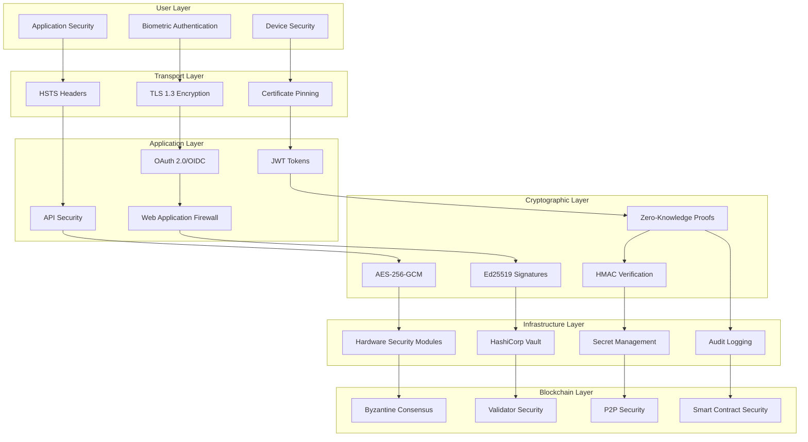

# PersonaPass Security Model 🛡️

> **Comprehensive security architecture documentation** - Deep dive into the security measures, cryptographic implementations, and privacy protections that make PersonaPass the most secure identity platform available.

## 📋 Table of Contents

- [Security Overview](#security-overview)
- [Threat Model](#threat-model)
- [Cryptographic Architecture](#cryptographic-architecture)
- [Zero-Knowledge Privacy](#zero-knowledge-privacy)
- [Authentication Systems](#authentication-systems)
- [Infrastructure Security](#infrastructure-security)
- [Compliance & Audits](#compliance--audits)
- [Incident Response](#incident-response)

## 🛡️ Security Overview

PersonaPass implements a **defense-in-depth security model** with multiple layers of protection:



### 🎯 Security Objectives

| Objective | Implementation | Status |
|-----------|----------------|--------|
| **Confidentiality** | End-to-end encryption, zero-knowledge proofs | ✅ Implemented |
| **Integrity** | Digital signatures, blockchain consensus | ✅ Implemented |
| **Availability** | Multi-region deployment, fault tolerance | ✅ Implemented |
| **Authentication** | Multi-factor, biometric, hardware-backed | ✅ Implemented |
| **Authorization** | RBAC, ABAC, fine-grained permissions | ✅ Implemented |
| **Non-repudiation** | Cryptographic proofs, audit trails | ✅ Implemented |
| **Privacy** | Zero-knowledge, selective disclosure | ✅ Implemented |

## 🎯 Threat Model

### 🔍 Threat Analysis Framework

PersonaPass addresses the following threat categories using the STRIDE model:

#### **S** - Spoofing Identity Threats
| Threat | Mitigation | Implementation |
|--------|------------|----------------|
| **Credential Forgery** | Digital signatures, PKI | Ed25519 signatures with DID verification |
| **Identity Impersonation** | Biometric binding | Liveness detection, device attestation |
| **Phishing Attacks** | Domain verification | Certificate pinning, verified issuer registry |
| **Replay Attacks** | Challenge-response | Nonces, timestamps, fresh challenges |

#### **T** - Tampering Threats
| Threat | Mitigation | Implementation |
|--------|------------|----------------|
| **Credential Modification** | Cryptographic hashes | SHA-256 content integrity |
| **Transaction Tampering** | Blockchain consensus | Byzantine fault tolerance |
| **Code Injection** | Input validation | Zod schema validation, sanitization |
| **Man-in-the-Middle** | End-to-end encryption | TLS 1.3, certificate pinning |

#### **R** - Repudiation Threats
| Threat | Mitigation | Implementation |
|--------|------------|----------------|
| **Transaction Denial** | Immutable ledger | Blockchain audit trail |
| **Action Denial** | Digital signatures | Non-repudiable cryptographic proofs |
| **Timestamp Disputes** | Trusted timestamping | RFC 3161 timestamping service |

#### **I** - Information Disclosure Threats
| Threat | Mitigation | Implementation |
|--------|------------|----------------|
| **Data Leakage** | Zero-knowledge proofs | Groth16, PLONK implementations |
| **Traffic Analysis** | Traffic padding | Tor-like onion routing (planned) |
| **Side-Channel Attacks** | Constant-time crypto | Timing-safe comparisons |
| **Metadata Leakage** | Minimal metadata | Privacy-first data structures |

#### **D** - Denial of Service Threats
| Threat | Mitigation | Implementation |
|--------|------------|----------------|
| **DDoS Attacks** | Rate limiting, CDN | Cloudflare protection, auto-scaling |
| **Resource Exhaustion** | Resource quotas | CPU/memory limits, circuit breakers |
| **Proof Generation DoS** | Proof caching | Redis caching, rate limiting |

#### **E** - Elevation of Privilege Threats
| Threat | Mitigation | Implementation |
|--------|------------|----------------|
| **Privilege Escalation** | Least privilege | RBAC with minimal permissions |
| **Admin Account Compromise** | MFA, HSM | Hardware-backed admin keys |
| **API Abuse** | Scope validation | OAuth scopes, API rate limiting |

### 🎭 Attack Scenarios

#### High-Value Attack Scenarios
1. **Nation-State Surveillance**: Mass credential harvesting
2. **Corporate Espionage**: Targeted credential theft
3. **Identity Fraud**: Large-scale impersonation
4. **Ransomware**: Credential encryption attacks
5. **Supply Chain**: Compromised dependencies

#### Mitigation Strategies
```typescript
// Example: Attack detection and response
class SecurityMonitor {
  private suspiciousActivityThreshold = 5;
  private anomalyDetection = new AnomalyDetector();
  
  async monitorCredentialAccess(userId: string, action: string): Promise<void> {
    const risk = await this.calculateRiskScore(userId, action);
    
    if (risk > 0.8) {
      await this.triggerSecurityAlert(userId, action, risk);
      await this.requireStepUpAuthentication(userId);
    }
    
    if (risk > 0.9) {
      await this.temporaryAccountLock(userId);
      await this.notifySecurityTeam(userId, action);
    }
  }
  
  private async calculateRiskScore(userId: string, action: string): Promise<number> {
    const factors = {
      deviceTrust: await this.getDeviceTrustScore(userId),
      locationAnomaly: await this.checkLocationAnomaly(userId),
      timeAnomaly: await this.checkTimeAnomaly(userId),
      behaviorAnomaly: await this.checkBehaviorPattern(userId, action)
    };
    
    return this.anomalyDetection.calculateRisk(factors);
  }
}
```

## 🔐 Cryptographic Architecture

### 🧮 Cryptographic Primitives

#### Digital Signatures
```typescript
// Ed25519 signature implementation
class Ed25519Signer {
  async sign(data: Uint8Array, privateKey: Uint8Array): Promise<Uint8Array> {
    // Constant-time signature generation
    const signature = await ed25519.sign(data, privateKey);
    
    // Verify signature immediately (paranoid mode)
    const publicKey = ed25519.getPublicKey(privateKey);
    const isValid = await ed25519.verify(signature, data, publicKey);
    
    if (!isValid) {
      throw new Error('Signature verification failed immediately after signing');
    }
    
    return signature;
  }
  
  async verify(
    signature: Uint8Array, 
    data: Uint8Array, 
    publicKey: Uint8Array
  ): Promise<boolean> {
    try {
      return await ed25519.verify(signature, data, publicKey);
    } catch (error) {
      // Log security event but don't expose details
      this.securityLogger.logVerificationFailure(error);
      return false;
    }
  }
}
```

#### Symmetric Encryption
```typescript
// AES-256-GCM encryption with key derivation
class SecureEncryption {
  async encrypt(
    data: Uint8Array, 
    password: string, 
    additionalData?: Uint8Array
  ): Promise<EncryptionResult> {
    // Generate cryptographically secure salt
    const salt = crypto.getRandomValues(new Uint8Array(32));
    
    // Derive key using PBKDF2 with high iteration count
    const key = await crypto.subtle.deriveKey(
      {
        name: 'PBKDF2',
        salt: salt,
        iterations: 600000, // OWASP recommended minimum
        hash: 'SHA-256'
      },
      await crypto.subtle.importKey('raw', new TextEncoder().encode(password), 'PBKDF2', false, ['deriveKey']),
      { name: 'AES-GCM', length: 256 },
      false,
      ['encrypt']
    );
    
    // Generate random IV
    const iv = crypto.getRandomValues(new Uint8Array(12));
    
    // Encrypt with authenticated encryption
    const encrypted = await crypto.subtle.encrypt(
      {
        name: 'AES-GCM',
        iv: iv,
        additionalData: additionalData
      },
      key,
      data
    );
    
    return {
      salt,
      iv,
      data: new Uint8Array(encrypted),
      additionalData
    };
  }
}
```

#### Hash Functions
```typescript
// Secure hashing with multiple algorithms
class SecureHashing {
  async hash(data: Uint8Array, algorithm: 'SHA-256' | 'SHA-512' | 'BLAKE2b'): Promise<Uint8Array> {
    switch (algorithm) {
      case 'SHA-256':
        return new Uint8Array(await crypto.subtle.digest('SHA-256', data));
      case 'SHA-512':
        return new Uint8Array(await crypto.subtle.digest('SHA-512', data));
      case 'BLAKE2b':
        return await blake2b(data, { dkLen: 64 });
      default:
        throw new Error(`Unsupported hash algorithm: ${algorithm}`);
    }
  }
  
  async hmac(data: Uint8Array, key: Uint8Array): Promise<Uint8Array> {
    const hmacKey = await crypto.subtle.importKey(
      'raw',
      key,
      { name: 'HMAC', hash: 'SHA-256' },
      false,
      ['sign']
    );
    
    const signature = await crypto.subtle.sign('HMAC', hmacKey, data);
    return new Uint8Array(signature);
  }
  
  async verifyHmac(
    data: Uint8Array, 
    signature: Uint8Array, 
    key: Uint8Array
  ): Promise<boolean> {
    const expected = await this.hmac(data, key);
    return crypto.subtle.timingSafeEqual(signature, expected);
  }
}
```

### 🔑 Key Management

#### Hierarchical Deterministic (HD) Keys
```typescript
// BIP32-like key derivation for DIDs
class HDKeyManager {
  private masterSeed: Uint8Array;
  
  constructor(mnemonic: string) {
    this.masterSeed = mnemonicToSeed(mnemonic);
  }
  
  async deriveKey(path: string): Promise<DerivedKey> {
    // Standard derivation path: m/44'/0'/0'/0/0
    const pathComponents = this.parsePath(path);
    
    let extendedKey = await this.masterKeyFromSeed(this.masterSeed);
    
    for (const component of pathComponents) {
      extendedKey = await this.deriveChild(extendedKey, component);
    }
    
    return {
      privateKey: extendedKey.privateKey,
      publicKey: extendedKey.publicKey,
      chainCode: extendedKey.chainCode,
      path: path
    };
  }
  
  async rotateMasterKey(): Promise<void> {
    // Generate new master seed
    const newMnemonic = generateMnemonic(256);
    const newSeed = mnemonicToSeed(newMnemonic);
    
    // Derive new keys for all existing paths
    const existingPaths = await this.getExistingPaths();
    const keyMigration = new KeyMigration(this.masterSeed, newSeed);
    
    await keyMigration.migrateKeys(existingPaths);
    
    // Update master seed after successful migration
    this.masterSeed = newSeed;
  }
}
```

#### Hardware Security Module Integration
```typescript
// HSM integration for high-security operations
class HSMKeyManager {
  private hsm: HSMClient;
  
  async generateKey(algorithm: KeyAlgorithm): Promise<HSMKeyReference> {
    return await this.hsm.generateKey({
      algorithm,
      keyUsage: ['sign', 'verify'],
      extractable: false, // Key cannot leave HSM
      persistent: true
    });
  }
  
  async sign(keyRef: HSMKeyReference, data: Uint8Array): Promise<Uint8Array> {
    // All signing operations happen within HSM
    return await this.hsm.sign(keyRef, data, {
      algorithm: 'Ed25519',
      deterministic: true
    });
  }
  
  async attestKeyGeneration(keyRef: HSMKeyReference): Promise<KeyAttestation> {
    // HSM provides cryptographic proof of key generation
    return await this.hsm.attestKey(keyRef);
  }
}
```

## 🧠 Zero-Knowledge Privacy

### 🎭 ZK Proof Systems

#### Groth16 Implementation
```typescript
// Groth16 zero-knowledge proof system
class Groth16ProofSystem {
  async generateProof(
    circuit: Circuit,
    privateInputs: PrivateInputs,
    publicInputs: PublicInputs
  ): Promise<Groth16Proof> {
    // Load proving key (should be cached)
    const provingKey = await this.loadProvingKey(circuit.id);
    
    // Generate witness from inputs
    const witness = await this.generateWitness(circuit, privateInputs, publicInputs);
    
    // Generate proof using Groth16 algorithm
    const proof = await groth16.fullProve(
      { ...privateInputs, ...publicInputs },
      circuit.wasmPath,
      provingKey
    );
    
    return {
      proof: proof.proof,
      publicSignals: proof.publicSignals,
      circuit: circuit.id,
      timestamp: Date.now()
    };
  }
  
  async verifyProof(
    proof: Groth16Proof,
    verificationKey: VerificationKey,
    publicInputs: PublicInputs
  ): Promise<boolean> {
    try {
      return await groth16.verify(
        verificationKey,
        proof.publicSignals,
        proof.proof
      );
    } catch (error) {
      this.logger.logVerificationError(error);
      return false;
    }
  }
}
```

#### Age Verification Circuit
```circom
pragma circom 2.0.0;

template AgeVerification() {
    // Private inputs (hidden from verifier)
    signal private input birthYear;
    signal private input birthMonth;
    signal private input birthDay;
    
    // Public inputs (known to verifier)
    signal input currentYear;
    signal input currentMonth;
    signal input currentDay;
    signal input minimumAge;
    
    // Output: 1 if age >= minimumAge, 0 otherwise
    signal output isOldEnough;
    
    // Calculate age
    component ageCalculator = AgeCalculator();
    ageCalculator.birthYear <== birthYear;
    ageCalculator.birthMonth <== birthMonth;
    ageCalculator.birthDay <== birthDay;
    ageCalculator.currentYear <== currentYear;
    ageCalculator.currentMonth <== currentMonth;
    ageCalculator.currentDay <== currentDay;
    
    // Check if age meets minimum requirement
    component ageComparator = GreaterThan(8); // 8 bits for age
    ageComparator.in[0] <== ageCalculator.age;
    ageComparator.in[1] <== minimumAge;
    
    isOldEnough <== ageComparator.out;
    
    // Constraint: birth year must be reasonable (1900-2024)
    component birthYearRange = Range(125); // 125 years
    birthYearRange.in <== birthYear;
    birthYearRange.min <== 1900;
    birthYearRange.max <== 2024;
    birthYearRange.out === 1;
}

component main = AgeVerification();
```

### 🔐 Selective Disclosure

#### BBS+ Signatures for Selective Disclosure
```typescript
// BBS+ signature scheme for selective disclosure
class BBSPlusSignature {
  async sign(
    messages: string[],
    privateKey: PrivateKey
  ): Promise<BBSSignature> {
    // Convert messages to field elements
    const messageElements = messages.map(msg => 
      this.hashToField(msg)
    );
    
    // Generate BBS+ signature
    const signature = await bbs.sign({
      key: privateKey,
      messages: messageElements
    });
    
    return {
      signature,
      messageCount: messages.length,
      keyId: privateKey.id
    };
  }
  
  async createProof(
    signature: BBSSignature,
    messages: string[],
    disclosed: number[], // Indices of disclosed messages
    publicKey: PublicKey,
    nonce: Uint8Array
  ): Promise<BBSProof> {
    const messageElements = messages.map(msg => 
      this.hashToField(msg)
    );
    
    const proof = await bbs.createProof({
      signature: signature.signature,
      publicKey: publicKey,
      messages: messageElements,
      disclosed: disclosed,
      nonce: nonce
    });
    
    return {
      proof,
      disclosed,
      nonce
    };
  }
  
  async verifyProof(
    proof: BBSProof,
    disclosedMessages: string[],
    publicKey: PublicKey
  ): Promise<boolean> {
    const disclosedElements = disclosedMessages.map(msg =>
      this.hashToField(msg)
    );
    
    return await bbs.verifyProof({
      proof: proof.proof,
      publicKey: publicKey,
      messages: disclosedElements,
      disclosed: proof.disclosed,
      nonce: proof.nonce
    });
  }
}
```

## 🔒 Authentication Systems

### 🧬 Biometric Authentication

#### Multi-Modal Biometric System
```typescript
// Advanced biometric authentication with liveness detection
class BiometricAuthenticator {
  private keyless: KeylessSDK;
  private livenessDetector: LivenessDetector;
  
  async enrollBiometric(
    userId: string,
    biometricType: BiometricType,
    biometricData: BiometricData
  ): Promise<EnrollmentResult> {
    // Perform liveness detection
    const livenessResult = await this.livenessDetector.detect(
      biometricData,
      biometricType
    );
    
    if (!livenessResult.isLive) {
      throw new BiometricError('Liveness detection failed', 'LIVENESS_FAILED');
    }
    
    // Quality assessment
    const quality = await this.assessQuality(biometricData, biometricType);
    if (quality < 0.8) {
      throw new BiometricError('Biometric quality too low', 'LOW_QUALITY');
    }
    
    // Enroll with Keyless SDK
    const enrollment = await this.keyless.enroll({
      userId,
      biometricType,
      biometricData,
      livenessToken: livenessResult.token,
      privacyLevel: 'zero_knowledge'
    });
    
    return {
      enrollmentId: enrollment.id,
      templateId: enrollment.templateId,
      confidence: quality,
      biometricMethod: biometricType
    };
  }
  
  async authenticateWithBiometric(
    userId: string,
    biometricData: BiometricData,
    challenge: string
  ): Promise<AuthenticationResult> {
    // Liveness detection for authentication
    const livenessResult = await this.livenessDetector.detect(
      biometricData,
      'face' // Assume face authentication
    );
    
    if (!livenessResult.isLive) {
      await this.logSecurityEvent('biometric_spoof_attempt', userId);
      throw new BiometricError('Liveness detection failed', 'SPOOF_DETECTED');
    }
    
    // Perform biometric matching
    const authResult = await this.keyless.authenticate({
      userId,
      biometricData,
      challenge,
      livenessToken: livenessResult.token
    });
    
    if (authResult.authenticated) {
      await this.generateZKProof(userId, authResult);
    }
    
    return authResult;
  }
  
  private async generateZKProof(
    userId: string,
    authResult: AuthenticationResult
  ): Promise<void> {
    // Generate zero-knowledge proof of biometric authentication
    // without revealing biometric template
    const zkProof = await this.zkProver.prove({
      statement: 'user_authenticated_with_biometric',
      privateInputs: {
        biometricTemplate: authResult.templateHash,
        matchingScore: authResult.confidence
      },
      publicInputs: {
        userId: userId,
        timestamp: Date.now(),
        minimumConfidence: 0.9
      }
    });
    
    // Store proof for audit purposes
    await this.auditLog.record({
      event: 'biometric_authentication',
      userId,
      proof: zkProof,
      timestamp: Date.now()
    });
  }
}
```

#### WebAuthn Integration
```typescript
// WebAuthn/FIDO2 integration for passwordless authentication
class WebAuthnManager {
  async registerCredential(
    userId: string,
    options: RegistrationOptions
  ): Promise<RegistrationResult> {
    const publicKeyCredentialCreationOptions: PublicKeyCredentialCreationOptions = {
      challenge: crypto.getRandomValues(new Uint8Array(32)),
      rp: {
        id: 'personapass.id',
        name: 'PersonaPass'
      },
      user: {
        id: new TextEncoder().encode(userId),
        name: options.username,
        displayName: options.displayName
      },
      pubKeyCredParams: [
        { alg: -7, type: 'public-key' }, // ES256
        { alg: -257, type: 'public-key' } // RS256
      ],
      authenticatorSelection: {
        authenticatorAttachment: options.authenticatorType,
        userVerification: 'required',
        residentKey: 'required'
      },
      timeout: 60000,
      attestation: 'direct'
    };
    
    const credential = await navigator.credentials.create({
      publicKey: publicKeyCredentialCreationOptions
    }) as PublicKeyCredential;
    
    // Verify attestation
    const attestationResult = await this.verifyAttestation(credential);
    
    if (!attestationResult.verified) {
      throw new WebAuthnError('Attestation verification failed');
    }
    
    // Store credential
    await this.storeCredential(userId, credential, attestationResult);
    
    return {
      credentialId: credential.id,
      attestationType: attestationResult.attestationType,
      authenticatorAAGUID: attestationResult.aaguid
    };
  }
  
  async authenticateWithCredential(
    credentialId: string,
    challenge: Uint8Array
  ): Promise<AuthenticationResult> {
    const publicKeyCredentialRequestOptions: PublicKeyCredentialRequestOptions = {
      challenge: challenge,
      allowCredentials: [{
        type: 'public-key',
        id: new TextEncoder().encode(credentialId)
      }],
      userVerification: 'required',
      timeout: 60000
    };
    
    const assertion = await navigator.credentials.get({
      publicKey: publicKeyCredentialRequestOptions
    }) as PublicKeyCredential;
    
    // Verify assertion
    const verificationResult = await this.verifyAssertion(
      assertion,
      challenge
    );
    
    return {
      verified: verificationResult.verified,
      counter: verificationResult.counter,
      userPresent: verificationResult.userPresent,
      userVerified: verificationResult.userVerified
    };
  }
}
```

### 🎫 Token-Based Authentication

#### JWT with Advanced Security
```typescript
// Secure JWT implementation with rotation and validation
class SecureJWTManager {
  private signingKeys: Map<string, CryptoKey> = new Map();
  private verificationKeys: Map<string, CryptoKey> = new Map();
  
  async issueToken(
    userId: string,
    scopes: string[],
    options: TokenOptions = {}
  ): Promise<TokenPair> {
    const now = Math.floor(Date.now() / 1000);
    const keyId = await this.getCurrentKeyId();
    const signingKey = this.signingKeys.get(keyId)!;
    
    // Access token payload
    const accessTokenPayload = {
      iss: 'https://auth.personapass.id',
      aud: 'https://api.personapass.id',
      sub: userId,
      iat: now,
      exp: now + (options.accessTokenTTL || 3600), // 1 hour default
      scope: scopes.join(' '),
      kid: keyId,
      jti: crypto.randomUUID(),
      // Security claims
      auth_time: now,
      amr: ['biometric', 'webauthn'], // Authentication methods
      acr: 'aal2' // Authentication context class reference
    };
    
    // Refresh token payload (longer lived, fewer claims)
    const refreshTokenPayload = {
      iss: 'https://auth.personapass.id',
      aud: 'https://auth.personapass.id',
      sub: userId,
      iat: now,
      exp: now + (options.refreshTokenTTL || 86400 * 30), // 30 days
      jti: crypto.randomUUID(),
      token_type: 'refresh'
    };
    
    const [accessToken, refreshToken] = await Promise.all([
      this.signJWT(accessTokenPayload, signingKey),
      this.signJWT(refreshTokenPayload, signingKey)
    ]);
    
    // Store refresh token hash for validation
    await this.storeRefreshTokenHash(refreshTokenPayload.jti, userId);
    
    return {
      accessToken,
      refreshToken,
      tokenType: 'Bearer',
      expiresIn: options.accessTokenTTL || 3600,
      scope: scopes.join(' ')
    };
  }
  
  async validateToken(token: string): Promise<TokenValidationResult> {
    try {
      // Decode without verification first to get kid
      const header = JSON.parse(
        atob(token.split('.')[0].replace(/-/g, '+').replace(/_/g, '/'))
      );
      
      const verificationKey = this.verificationKeys.get(header.kid);
      if (!verificationKey) {
        throw new JWTError('Unknown key ID', 'UNKNOWN_KID');
      }
      
      // Verify signature and decode payload
      const payload = await this.verifyJWT(token, verificationKey);
      
      // Additional security validations
      await this.validateSecurityClaims(payload);
      
      return {
        valid: true,
        payload,
        userId: payload.sub,
        scopes: payload.scope?.split(' ') || []
      };
    } catch (error) {
      this.logger.logTokenValidationFailure(error);
      return {
        valid: false,
        error: error.message
      };
    }
  }
  
  private async validateSecurityClaims(payload: any): Promise<void> {
    const now = Math.floor(Date.now() / 1000);
    
    // Check token freshness (not too old even if not expired)
    if (payload.iat && (now - payload.iat) > 86400) { // 24 hours
      throw new JWTError('Token too old', 'TOKEN_TOO_OLD');
    }
    
    // Check authentication time for sensitive operations
    if (payload.auth_time && (now - payload.auth_time) > 3600) { // 1 hour
      throw new JWTError('Authentication too old for sensitive operation', 'AUTH_TOO_OLD');
    }
    
    // Validate authentication methods
    if (!payload.amr || !payload.amr.includes('biometric')) {
      throw new JWTError('Insufficient authentication method', 'INSUFFICIENT_AUTH');
    }
  }
  
  async rotateKeys(): Promise<void> {
    // Generate new signing key
    const newKeyId = crypto.randomUUID();
    const newKeyPair = await crypto.subtle.generateKey(
      {
        name: 'Ed25519',
        namedCurve: 'Ed25519'
      },
      true,
      ['sign', 'verify']
    );
    
    // Add new keys
    this.signingKeys.set(newKeyId, newKeyPair.privateKey);
    this.verificationKeys.set(newKeyId, newKeyPair.publicKey);
    
    // Keep old keys for token validation during rotation period
    setTimeout(() => {
      // Remove old keys after grace period
      const oldKeyIds = Array.from(this.signingKeys.keys())
        .filter(id => id !== newKeyId);
      
      oldKeyIds.forEach(id => {
        this.signingKeys.delete(id);
        this.verificationKeys.delete(id);
      });
    }, 3600000); // 1 hour grace period
  }
}
```

## 🏗️ Infrastructure Security

### 🌐 Network Security

#### TLS Configuration
```yaml
# NGINX TLS configuration for maximum security
server {
    listen 443 ssl http2;
    server_name api.personapass.id;
    
    # TLS 1.3 only
    ssl_protocols TLSv1.3;
    
    # Strong cipher suites
    ssl_ciphers 'TLS_AES_256_GCM_SHA384:TLS_CHACHA20_POLY1305_SHA256:TLS_AES_128_GCM_SHA256';
    ssl_prefer_server_ciphers off;
    
    # Certificate configuration
    ssl_certificate /etc/ssl/certs/personapass.crt;
    ssl_certificate_key /etc/ssl/private/personapass.key;
    
    # OCSP stapling
    ssl_stapling on;
    ssl_stapling_verify on;
    ssl_trusted_certificate /etc/ssl/certs/chain.crt;
    
    # Security headers
    add_header Strict-Transport-Security "max-age=31536000; includeSubDomains; preload" always;
    add_header X-Frame-Options "DENY" always;
    add_header X-Content-Type-Options "nosniff" always;
    add_header X-XSS-Protection "1; mode=block" always;
    add_header Referrer-Policy "strict-origin-when-cross-origin" always;
    add_header Content-Security-Policy "default-src 'self'; script-src 'self' 'unsafe-inline'; style-src 'self' 'unsafe-inline'; img-src 'self' data: https:; font-src 'self'; connect-src 'self' wss:; frame-ancestors 'none';" always;
    
    # Certificate pinning
    add_header Public-Key-Pins 'pin-sha256="base64+primary=="; pin-sha256="base64+backup=="; max-age=2592000; includeSubDomains';
}
```

#### API Gateway Security
```typescript
// Comprehensive API security middleware
class APISecurityMiddleware {
  async authenticateRequest(req: Request, res: Response, next: NextFunction): Promise<void> {
    try {
      // Extract token from Authorization header
      const authHeader = req.headers.authorization;
      if (!authHeader?.startsWith('Bearer ')) {
        throw new AuthenticationError('Missing or invalid authorization header');
      }
      
      const token = authHeader.substring(7);
      
      // Validate JWT token
      const validation = await this.jwtManager.validateToken(token);
      if (!validation.valid) {
        throw new AuthenticationError('Invalid token');
      }
      
      // Check rate limiting
      await this.rateLimiter.checkLimit(validation.userId, req.ip);
      
      // Validate scopes for endpoint
      const requiredScopes = this.getRequiredScopes(req.path, req.method);
      if (!this.hasRequiredScopes(validation.scopes, requiredScopes)) {
        throw new AuthorizationError('Insufficient permissions');
      }
      
      // Add user context to request
      req.user = {
        id: validation.userId,
        scopes: validation.scopes
      };
      
      next();
    } catch (error) {
      await this.securityLogger.logAuthFailure(req, error);
      res.status(401).json({ error: error.message });
    }
  }
  
  async validateInputs(req: Request, res: Response, next: NextFunction): Promise<void> {
    try {
      const schema = this.getValidationSchema(req.path, req.method);
      
      // Validate request body
      if (req.body && schema.body) {
        schema.body.parse(req.body);
      }
      
      // Validate query parameters
      if (schema.query) {
        schema.query.parse(req.query);
      }
      
      // Validate path parameters
      if (schema.params) {
        schema.params.parse(req.params);
      }
      
      next();
    } catch (error) {
      res.status(400).json({ 
        error: 'Validation failed', 
        details: error.issues 
      });
    }
  }
  
  async checkSecurityHeaders(req: Request, res: Response, next: NextFunction): Promise<void> {
    // Validate required security headers
    const requiredHeaders = [
      'user-agent',
      'x-requested-with',
      'x-api-version'
    ];
    
    for (const header of requiredHeaders) {
      if (!req.headers[header]) {
        await this.securityLogger.logSuspiciousRequest(req, `Missing ${header} header`);
      }
    }
    
    // Check for suspicious user agents
    const userAgent = req.headers['user-agent'];
    if (this.isSuspiciousUserAgent(userAgent)) {
      await this.securityLogger.logSuspiciousRequest(req, 'Suspicious user agent');
      res.status(403).json({ error: 'Forbidden' });
      return;
    }
    
    next();
  }
}
```

### 🛡️ Container Security

#### Dockerfile Security Best Practices
```dockerfile
# Multi-stage build with security hardening
FROM node:18-alpine AS builder

# Create non-root user
RUN addgroup -g 1001 -S nodejs
RUN adduser -S nextjs -u 1001

# Set working directory
WORKDIR /app

# Copy package files
COPY package*.json ./

# Install dependencies with security audit
RUN npm ci --only=production --audit

# Copy application code
COPY --chown=nextjs:nodejs . .

# Build application
RUN npm run build

# Production stage
FROM node:18-alpine AS runner

# Install security updates
RUN apk update && apk upgrade && apk add --no-cache dumb-init

# Create non-root user
RUN addgroup -g 1001 -S nodejs
RUN adduser -S nextjs -u 1001

WORKDIR /app

# Copy built application
COPY --from=builder --chown=nextjs:nodejs /app/dist ./dist
COPY --from=builder --chown=nextjs:nodejs /app/node_modules ./node_modules
COPY --from=builder --chown=nextjs:nodejs /app/package.json ./package.json

# Switch to non-root user
USER nextjs

# Expose port
EXPOSE 3000

# Health check
HEALTHCHECK --interval=30s --timeout=3s --start-period=5s --retries=3 \
  CMD curl -f http://localhost:3000/health || exit 1

# Use dumb-init to handle signals
ENTRYPOINT ["dumb-init", "--"]

# Start application
CMD ["node", "dist/index.js"]
```

## 🔍 Compliance & Audits

### 📋 Regulatory Compliance

#### GDPR Compliance Implementation
```typescript
// GDPR compliance manager
class GDPRComplianceManager {
  async handleDataSubjectRequest(
    request: DataSubjectRequest
  ): Promise<DataSubjectResponse> {
    switch (request.type) {
      case 'access':
        return await this.handleAccessRequest(request);
      case 'rectification':
        return await this.handleRectificationRequest(request);
      case 'erasure':
        return await this.handleErasureRequest(request);
      case 'portability':
        return await this.handlePortabilityRequest(request);
      case 'objection':
        return await this.handleObjectionRequest(request);
      default:
        throw new Error(`Unsupported request type: ${request.type}`);
    }
  }
  
  private async handleAccessRequest(
    request: DataSubjectRequest
  ): Promise<DataSubjectResponse> {
    // Collect all personal data
    const personalData = await this.collectPersonalData(request.subjectId);
    
    // Anonymize sensitive fields
    const anonymizedData = this.anonymizeData(personalData);
    
    // Generate portable format
    const exportData = {
      credentials: anonymizedData.credentials,
      presentations: anonymizedData.presentations,
      auditLog: anonymizedData.auditLog,
      preferences: anonymizedData.preferences,
      metadata: {
        exportDate: new Date().toISOString(),
        dataController: 'PersonaPass Ltd.',
        legalBasis: 'Article 6(1)(a) - Consent'
      }
    };
    
    return {
      status: 'completed',
      data: exportData,
      format: 'JSON',
      fulfillmentDate: new Date()
    };
  }
  
  private async handleErasureRequest(
    request: DataSubjectRequest
  ): Promise<DataSubjectResponse> {
    // Verify right to erasure
    const canErase = await this.verifyErasureRight(request);
    
    if (!canErase.allowed) {
      return {
        status: 'rejected',
        reason: canErase.reason,
        fulfillmentDate: new Date()
      };
    }
    
    // Perform soft deletion (blockchain data cannot be truly deleted)
    await this.performSoftDeletion(request.subjectId);
    
    // Notify data processors
    await this.notifyProcessors('erasure', request.subjectId);
    
    return {
      status: 'completed',
      fulfillmentDate: new Date()
    };
  }
}
```

#### SOC 2 Type II Controls
```typescript
// SOC 2 controls implementation
class SOC2Controls {
  // CC6.1 - Security commitments and system requirements
  async enforceSecurityCommitments(): Promise<void> {
    await this.validateSecurityPolicies();
    await this.enforceAccessControls();
    await this.monitorSecurityEvents();
  }
  
  // CC6.2 - Logical and physical access controls
  async enforceAccessControls(): Promise<void> {
    // Multi-factor authentication
    await this.enforceMFA();
    
    // Principle of least privilege
    await this.reviewAccessRights();
    
    // Regular access reviews
    await this.conductAccessReview();
  }
  
  // CC6.3 - Network security
  async enforceNetworkSecurity(): Promise<void> {
    // Intrusion detection
    await this.monitorNetworkTraffic();
    
    // Firewall rules
    await this.validateFirewallRules();
    
    // VPN access
    await this.enforceVPNAccess();
  }
  
  // CC6.8 - System monitoring
  async monitorSystemHealth(): Promise<void> {
    const metrics = await this.collectSystemMetrics();
    
    // Check for anomalies
    if (metrics.errorRate > 0.01) {
      await this.triggerAlert('high_error_rate', metrics);
    }
    
    if (metrics.responseTime > 2000) {
      await this.triggerAlert('slow_response', metrics);
    }
    
    // Log monitoring results
    await this.auditLogger.log('system_monitoring', metrics);
  }
}
```

### 🔒 Security Audits

#### Automated Security Scanning
```yaml
# Security scanning pipeline
name: Security Audit

on:
  push:
    branches: [ main, develop ]
  pull_request:
    branches: [ main ]
  schedule:
    - cron: '0 2 * * *' # Daily at 2 AM

jobs:
  dependency-scan:
    runs-on: ubuntu-latest
    steps:
      - uses: actions/checkout@v3
      - name: Audit npm dependencies
        run: npm audit --audit-level high
      - name: Snyk security scan
        uses: snyk/actions/node@master
        env:
          SNYK_TOKEN: ${{ secrets.SNYK_TOKEN }}
  
  code-scan:
    runs-on: ubuntu-latest
    steps:
      - uses: actions/checkout@v3
      - name: Run Semgrep
        uses: securecodewarrior/github-action-add-sarif@v1
        with:
          sarif-file: semgrep-results.sarif
      - name: Run CodeQL
        uses: github/codeql-action/analyze@v2
        with:
          languages: 'typescript,javascript'
  
  container-scan:
    runs-on: ubuntu-latest
    steps:
      - uses: actions/checkout@v3
      - name: Build image
        run: docker build -t personapass:test .
      - name: Scan with Trivy
        uses: aquasecurity/trivy-action@master
        with:
          image-ref: 'personapass:test'
          format: 'sarif'
          output: 'trivy-results.sarif'
```

## 🚨 Incident Response

### 📞 Security Incident Response Plan

#### Incident Classification
| Severity | Description | Response Time | Examples |
|----------|-------------|---------------|----------|
| **P0 - Critical** | Active security breach | 15 minutes | Data exfiltration, system compromise |
| **P1 - High** | Potential security threat | 1 hour | Failed authentication spike, suspicious activity |
| **P2 - Medium** | Security policy violation | 4 hours | Unauthorized access attempt, policy bypass |
| **P3 - Low** | Security configuration issue | 24 hours | Misconfiguration, expired certificates |

#### Incident Response Automation
```typescript
// Automated incident response system
class IncidentResponseSystem {
  async handleSecurityEvent(event: SecurityEvent): Promise<void> {
    const severity = await this.classifyIncident(event);
    
    // Immediate automated response
    switch (severity) {
      case 'P0':
        await this.executeEmergencyProtocol(event);
        break;
      case 'P1':
        await this.executeHighSeverityProtocol(event);
        break;
      case 'P2':
        await this.executeMediumSeverityProtocol(event);
        break;
      case 'P3':
        await this.executeLowSeverityProtocol(event);
        break;
    }
    
    // Create incident record
    const incident = await this.createIncidentRecord(event, severity);
    
    // Notify response team
    await this.notifyResponseTeam(incident);
    
    // Start automated remediation
    await this.startRemediation(incident);
  }
  
  private async executeEmergencyProtocol(event: SecurityEvent): Promise<void> {
    // Immediate containment
    await this.isolateAffectedSystems(event.affectedSystems);
    
    // Block suspicious IPs
    await this.blockSuspiciousIPs(event.sourceIPs);
    
    // Revoke compromised tokens
    if (event.type === 'token_compromise') {
      await this.revokeTokens(event.compromisedTokens);
    }
    
    // Enable enhanced monitoring
    await this.enableEnhancedMonitoring();
    
    // Notify stakeholders immediately
    await this.sendEmergencyNotification(event);
  }
  
  private async executeHighSeverityProtocol(event: SecurityEvent): Promise<void> {
    // Enhanced monitoring
    await this.increaseMonitoringLevel(event.affectedSystems);
    
    // Rate limiting
    await this.enforceStrictRateLimiting(event.sourceIPs);
    
    // Additional authentication
    await this.requireAdditionalAuth(event.affectedUsers);
    
    // Evidence collection
    await this.collectForensicEvidence(event);
  }
}
```

#### Breach Notification Procedures
```typescript
// GDPR-compliant breach notification
class BreachNotificationManager {
  async handleDataBreach(breach: DataBreach): Promise<void> {
    // Assess breach severity
    const assessment = await this.assessBreachSeverity(breach);
    
    // 72-hour notification to supervisory authority (GDPR Article 33)
    if (assessment.riskLevel >= 'high') {
      await this.notifySupervisoryAuthority(breach, assessment);
    }
    
    // Notification to data subjects (GDPR Article 34)
    if (assessment.riskLevel >= 'very_high') {
      await this.notifyDataSubjects(breach, assessment);
    }
    
    // Internal notifications
    await this.notifyInternalStakeholders(breach, assessment);
    
    // Regulatory filings
    await this.fileRegulatoryNotifications(breach, assessment);
  }
  
  private async assessBreachSeverity(breach: DataBreach): Promise<BreachAssessment> {
    const factors = {
      dataTypes: this.assessDataSensitivity(breach.affectedData),
      userCount: breach.affectedUsers.length,
      breachType: breach.type,
      containmentTime: breach.containmentTime,
      potentialImpact: await this.assessPotentialImpact(breach)
    };
    
    const riskScore = this.calculateRiskScore(factors);
    
    return {
      riskLevel: this.mapRiskLevel(riskScore),
      riskScore,
      factors,
      recommendedActions: await this.generateRecommendations(factors)
    };
  }
}
```

---

<div align="center">

**🛡️ Security is not a feature, it's a fundamental right**

[📖 Back to Documentation](README.md) | [🔍 Threat Model](THREAT_MODEL.md) | [📋 Compliance](COMPLIANCE.md)

*Building the most secure identity platform in the world* 🌟

</div>